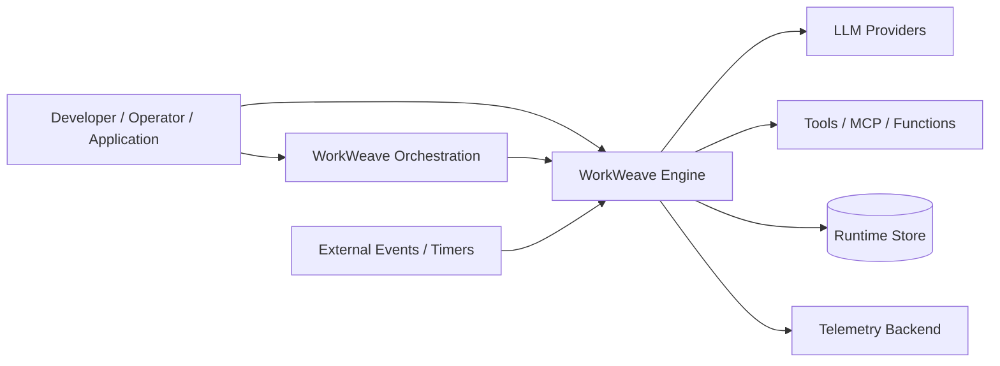
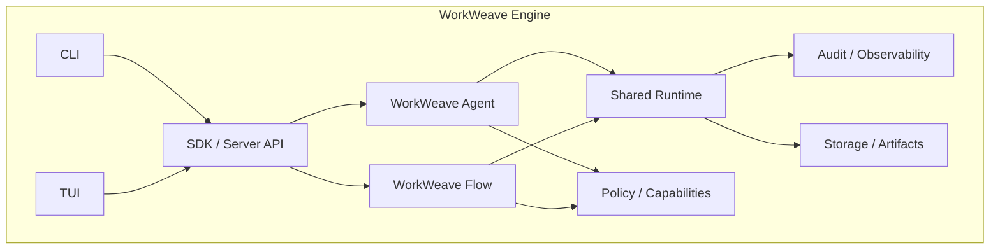
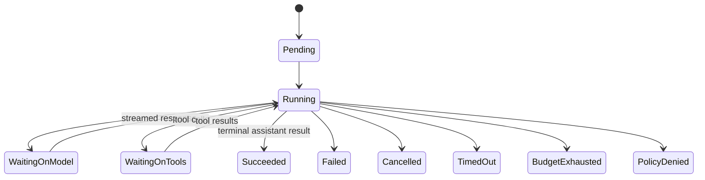
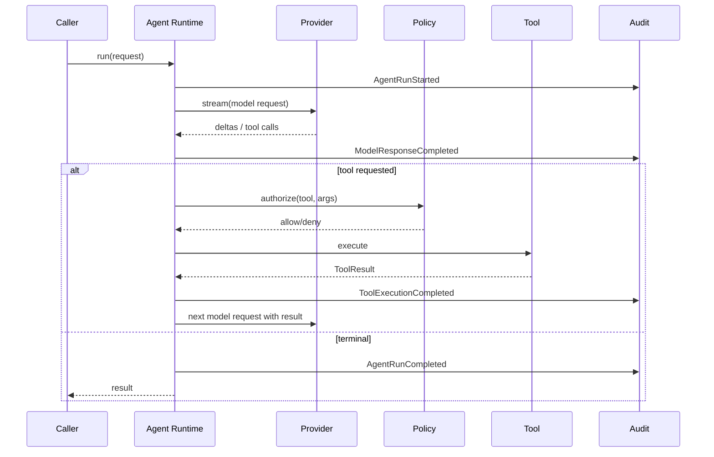
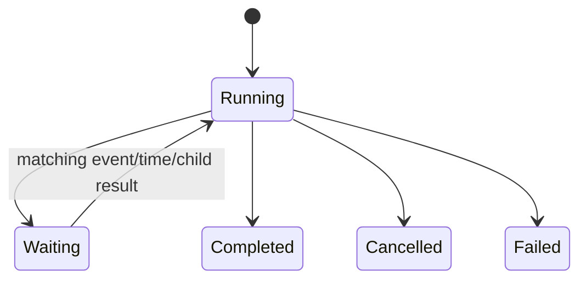
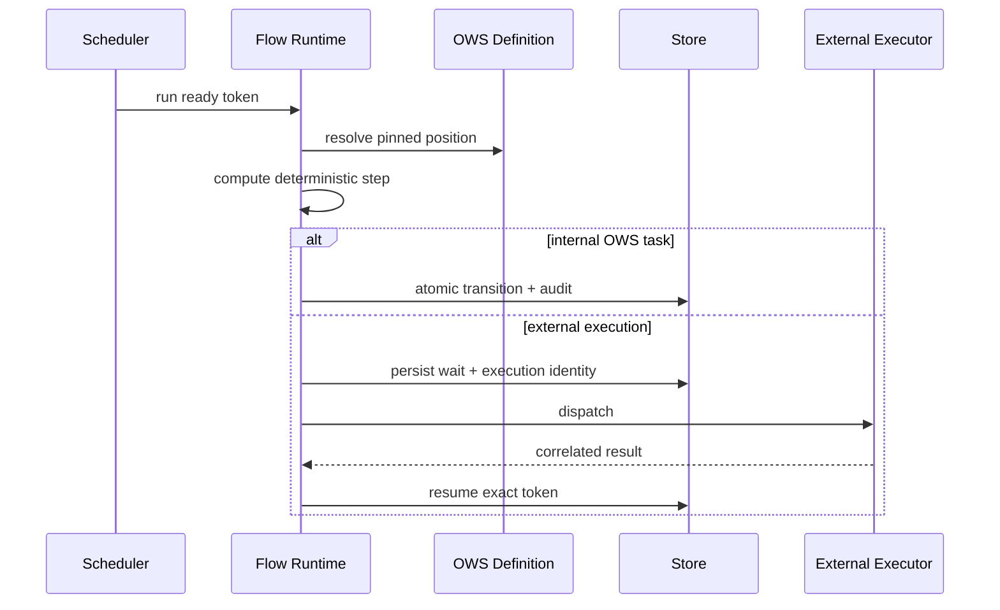
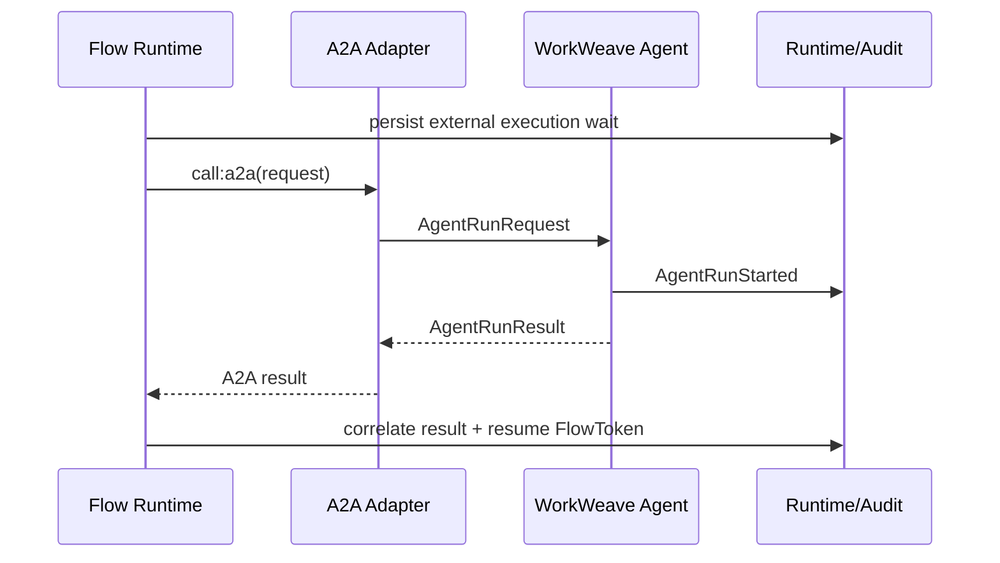

# WorkWeave Engine Architecture Dossier

## 1. Executive summary

WorkWeave Engine should be one Rust execution platform containing two sibling kernels:

- **WorkWeave Agent** executes bounded probabilistic LLM/tool work.
- **WorkWeave Flow** executes accepted OWS workflows deterministically and durably.

A shared runtime substrate provides execution identity, lifecycle, cancellation, deadlines, budgets, persistence, worker coordination, policy, artifacts, audit, telemetry, configuration and deployment facilities.

The shared substrate must not collapse Agent and Flow into a generic graph/node machine. Their semantics differ at the point that matters most: how the next action is chosen.

```text
Flow:  definition + durable state -> deterministic next transition
Agent: context + model             -> probabilistic next action
```

WorkWeave Orchestration is a separate layer above the engine. It owns governed work meaning: Goals, Tasks, Questions, Decisions, Evaluations, Reviews and epistemic/deontic/temporal derivations. It can dispatch an Agent or Flow just as a process system can dispatch a deterministic job or human task.

## 2. Reference map

```text
Pi Agent ----------------------> WorkWeave Agent
  provider/model loop              probabilistic worker
  tools/events/sessions            provider/tool abstraction
  CLI/TUI/SDK/server               audit + product surfaces

Pi future Harness ------------> runtime/orchestration reference
  operations/lanes/records         durable run coordination ideas
  reducer/recovery                 reconstructable execution
  incomplete scaffold              not copied as current behavior

OWS --------------------------> WorkWeave Flow definition authority
  workflow syntax/control flow     accepted workflow semantics

LangGraph --------------------> WorkWeave Flow runtime reference
  checkpoints                    durability
  interrupts                     suspend/resume
  streaming                      inspection
  Pregel runtime                 deterministic stepping ideas
```

## 3. Foundational boundary

An Agent is a probabilistic atomic worker analogous to a deterministic Job:

```text
Process / orchestration
  |
  +-- Job -------- deterministic bounded worker
  +-- Agent ------ probabilistic bounded worker
  +-- Human Task - human bounded worker
  +-- Flow ------- deterministic durable composed execution
```

Atomic means bounded identity and lifecycle, not necessarily one database transaction. An `AgentRun` has an input/config snapshot, emitted events, tool/model calls, artifacts, usage and one terminal status.

## 4. C1 — system context



External responsibilities:

- Orchestration decides governed work and can choose an execution primitive.
- Providers infer Agent actions.
- OWS documents define Flow behavior.
- tools/functions/MCP perform external effects.
- events/timers resume deterministic waits.
- callers use SDK/CLI/TUI/server APIs.

## 5. C2 — containers



The public product can be one `ww` executable and one SDK namespace while internal crates remain strongly separated.

## 6. C3 — shared runtime components

### Execution registry

Owns engine-wide execution identity, parent/child linkage, lifecycle and terminal status. It does not own Agent messages or Flow positions.

### Cancellation/deadline service

Propagates cancellation from parent to child executions and exposes structured deadlines/timeouts.

### Budget service

Tracks model tokens/cost, execution duration, tool counts or configured resource limits. Agent-specific budgets can extend the common envelope.

### Audit journal

Writes ordered durable events sufficient to reconstruct what the engine did without relying on hidden model reasoning.

### Artifact store

Stores or references large outputs, patches, files and external artifacts with digest/provenance.

### Policy engine

Decides filesystem/network/process/tool/provider capabilities and approval requirements. Domain authority remains outside this engine-level policy.

### Worker/scheduler substrate

Provides leases, ready work, timers and delivery for server deployments. Embedded mode can use in-process workers while preserving the same logical contracts.

### Storage ports

Expose transactions and aggregate/event persistence independent of SQLite/PostgreSQL details.

### Observability bridge

Exports traces, metrics and logs while audit remains canonical run evidence.

## 7. C3 — WorkWeave Agent

### Agent runtime

Owns one `AgentRun` and the model/tool loop.

### Provider registry

Maps provider/model references to normalized streaming adapters.

### Context assembler

Builds model-facing messages from Agent context. This is execution context assembly, not WorkWeave Orchestration semantic context compilation.

### Tool registry/executor

Advertises typed tool schemas, validates arguments, obtains policy decisions, executes allowed tools and returns normalized results.

### Run queues

Supports steering/follow-up messages where the product surface needs Pi-like interaction.

### Agent event stream

Feeds audit plus CLI/TUI/SDK streaming without coupling presentation to execution.

## 8. C3 — WorkWeave Flow

### OWS definition repository

Retains accepted source and source digest, validates the frozen WorkWeave profile and resolves a `WorkflowRef` immutably.

### OWS parser/runtime plan

May normalize accepted OWS for execution efficiency. The normalized plan is never a second canonical authored definition.

### Flow interpreter

Given pinned definition + durable Flow snapshot, computes the next deterministic transition or external execution requirement.

### Flow transaction coordinator

Atomically applies token/context/instance changes and durable audit events.

### Wait manager

Persists time/event/external-execution waits and resumes only matching tokens.

### Scheduler

Discovers ready tokens/timers, handles leases and dispatches external work.

### External execution adapters

- A2A Agent;
- MCP;
- function/service;
- nested OWS workflow.

## 9. C4 — critical interfaces

### Shared execution

```rust
#[async_trait]
pub trait Executor<Rq, Rs>: Send + Sync {
    async fn execute(
        &self,
        request: Rq,
        ctx: ExecutionContext,
    ) -> Result<ExecutionHandle<Rs>, ExecutionError>;
}
```

This is intentionally thin. It supplies lifecycle composition, not shared internal semantics.

### Agent provider

```rust
#[async_trait]
pub trait ModelProvider: Send + Sync {
    async fn stream(
        &self,
        request: ModelRequest,
        ctx: ProviderContext,
    ) -> Result<ModelEventStream, ProviderError>;
}
```

Inspired by Pi's `StreamFn` seam.

### Agent tool

```rust
#[async_trait]
pub trait Tool: Send + Sync {
    fn spec(&self) -> ToolSpec;
    async fn execute(&self, request: ToolRequest, ctx: ToolContext) -> ToolResult;
}
```

Policy is applied outside the tool.

### Flow interpreter

```rust
pub trait FlowInterpreter {
    fn step(
        &self,
        definition: &AcceptedWorkflow,
        snapshot: FlowSnapshot,
    ) -> Result<FlowDecision, FlowError>;
}
```

The output is a deterministic decision to advance, spawn, wait, invoke, complete or fail.

### A2A seam

Flow uses the A2A contract. A local adapter maps that contract to the local Agent executor; a remote adapter maps the same contract to transport.

## 10. WorkWeave Agent lifecycle



One run can contain multiple model turns and tool batches.

## 11. Agent sequence



## 12. WorkWeave Flow lifecycle

Canonical conceptual states remain aligned with WorkWeave Flow v0.5:



A `FlowInstance` owns multiple `FlowToken`s. A token may be ready, active, waiting, consumed, cancelled or failed.

## 13. Flow deterministic step



The crash-safe order is important: persist durable intent/wait before dispatching non-idempotent external execution, or use an outbox/lease design that makes redelivery safe.

## 14. Flow-to-Agent



Flow never reaches into Agent conversation/tool state. Agent never reaches into Flow token internals.

## 15. Domain model of the engine layer

### Shared operational concepts

- `Execution` — bounded operational identity.
- `ExecutionEvent` — ordered durable audit occurrence.
- `Artifact` — referenced output with digest/provenance.
- `PolicyDecision` — capability/approval decision.
- `ResourceBudget` — configured operational limits.
- `ExecutionLink` — parent/child/correlation relationship.

### Agent concepts

- `AgentDefinition`;
- `AgentRun`;
- `AgentContext`;
- `AgentMessage`;
- `ModelRef`;
- `ModelRequest`;
- `ModelResponse`;
- `ToolSpec`;
- `ToolCall`;
- `ToolExecution`;
- `AgentRunResult`.

### Flow concepts

Canonical conceptual ownership stays in WorkWeave Flow v0.5:

- `FlowInstance`;
- `FlowToken`;
- `WorkflowRef`;
- `WorkflowPosition`;
- `WorkflowContextState`;
- `ExecutionLineage`;
- `WaitState`.

Runtime-only normalization types remain Architecture internals.

## 16. Persistence architecture

### Embedded profile

Start with SQLite because it enables one deployable binary and transactional durability.

Logical storage areas may include:

```text
executions
execution_events
artifacts
agent_runs
agent_messages / agent_entries
flow_instances
flow_tokens
workflow_definitions
external_executions
wait_correlations
outbox
```

These table names are not Domain/Flow model concepts.

### Coordinated profile

PostgreSQL can later provide:

- multi-worker leases;
- higher write concurrency;
- central scheduling;
- remote server deployment;
- horizontal workers.

The storage port must preserve semantic behavior across profiles.

## 17. Audit model

Audit must answer:

- what execution ran and why it was invoked;
- exact configuration/model/tool/workflow pins;
- what provider calls occurred;
- what tool/external calls occurred;
- policy decisions;
- outputs/errors/artifacts;
- cancellation/retry/timeout events;
- parent/child relationships;
- terminal result and usage.

Audit explicitly does not require hidden chain-of-thought.

The audit journal and OpenTelemetry should share correlation IDs, but traces can be sampled/exported while canonical audit cannot silently disappear.

## 18. Policy and trust boundaries

Engine-level governance includes:

- provider allow/deny;
- model allow/deny;
- tool allow/deny;
- filesystem roots and write scope;
- subprocess policy;
- network egress policy;
- secret exposure;
- approval requirements;
- budget/deadline enforcement.

These are execution policy, not WorkWeave Domain authority.

Pi's project-trust mechanism is a useful product precedent. WorkWeave should centralize policy rather than embedding ad hoc confirmation logic in every tool.

## 19. SDK

Both engines are first-class:

```rust
let agent_run = ww.agent().run(agent_request).await?;
let flow_run = ww.flow().start(workflow_ref, input).await?;
```

Inspection should cross the shared execution graph:

```rust
let execution = ww.runs().get(id).await?;
let events = ww.runs().events(id).await?;
let children = ww.runs().children(id).await?;
```

## 20. CLI

```text
ww agent run
ww agent inspect
ww agent cancel

ww flow validate
ww flow run
ww flow inspect
ww flow signal
ww flow cancel

ww run inspect
ww run events
ww run tree
```

## 21. TUI

### Agent view

- transcript;
- active model/provider;
- tool calls/results;
- workspace effects/artifacts;
- token/cost usage;
- policy decisions;
- cancellation/steering.

### Flow view

- pinned workflow identity;
- current tokens/positions;
- branches and iterations;
- waits/timers;
- child Agent/Flow executions;
- workflow context;
- retries/signals;
- terminal output.

### Shared view

A run tree lets operators move from Flow -> Agent -> Tool or Flow -> nested Flow while retaining one correlation trail.

## 22. Deployment profiles

### Embedded

```text
application / CLI / TUI
        |
   in-process SDK
        |
Agent + Flow + Runtime
        |
      SQLite
```

### Server

```text
SDK/CLI/TUI
    |
ww-server API
    |
execution coordinator
    |
+--------+---------+
|                  |
Agent workers   Flow workers
|                  |
+--------+---------+
         |
     PostgreSQL
```

Remote provider/tool/A2A/MCP transports are adapters at execution boundaries.

## 23. Reference tradeoffs

### Pi

Preserve: small loop, provider seam, tools, event streaming, cancellation, session/service boundaries.

Simplify: provider breadth, monolithic coding session, TypeScript extension dynamism, UI coupling.

### Pi Harness

Preserve conceptually: operation records, reduction/recovery, snapshots/actions.

Reject as evidence of current production behavior: incomplete public operations.

### OWS

Preserve as definition authority. Implement only the qualified profile first and fail closed on unsupported semantics.

### LangGraph

Preserve runtime lessons: checkpointing, interrupts, deterministic stepping, scoped streaming and durable resume.

Reject: its graph DSL as WorkWeave definition authority.

## 24. G002 falsification slice

The next Goal should prove the architecture with the smallest executable vertical slice:

### Shared runtime

- Rust workspace;
- execution IDs and parent/child links;
- cancellation token;
- SQLite store;
- ordered audit journal;
- inspection API.

### Agent

- one provider adapter;
- normalized streamed text/tool calls;
- one model -> tool -> model loop;
- 2–3 simple tools;
- terminal states and cancellation.

### Flow

- accept/pin one OWS document;
- strict profile validation;
- implement `set`, `switch`, `call:a2a`, and terminal flow for the spike;
- persist FlowInstance/FlowToken/context;
- durable external execution wait;
- resume after process restart.

### Integration

- Flow invokes local Agent through A2A adapter;
- Flow persists wait before dispatch;
- Agent result resumes exact FlowToken;
- audit tree shows Flow -> Agent -> Tool.

### CLI

```text
ww agent run <prompt>
ww flow run workflow.yaml
ww run inspect <id>
ww run events <id>
```

If this slice cannot remain cleanly separated, the architecture is wrong and should be revised before feature expansion.

## 25. Open risks

- strict jq implementation compatibility;
- OWS normalization accidentally becoming a second definition source;
- duplicate audit vs execution state;
- crash windows around external dispatch;
- idempotency of tools/agents/external functions;
- cancellation propagation across parent/child executions;
- provider normalization leaking vendor semantics into core Agent types;
- shared-runtime abstractions becoming so broad that they erase engine-specific invariants;
- premature remote/plugin/sandbox complexity.

## 26. Architectural invariant summary

1. One Rust platform; two sibling kernels.
2. Agent is probabilistic and bounded.
3. Flow is deterministic and durable.
4. OWS is Flow-definition authority.
5. WorkWeave Orchestration remains above the engine.
6. Shared runtime owns operational concerns, not engine semantics.
7. Flow-to-Agent uses an explicit execution/A2A seam.
8. Agent/Flow model calls and tool calls are auditable without becoming semantic orchestration records.
9. SDK, CLI and TUI expose Agent and Flow directly.
10. The first implementation slice must be small enough to falsify these boundaries.
