# WorkWeave Engine Architecture and Implementation Dossier

## 0. Document contract

This file is the primary architecture direction for **WorkWeave Engine**. It is intentionally self-contained. The smaller architecture files in this repository may remain useful as research notes, but this dossier owns the consolidated implementation direction until a later accepted architecture decision supersedes it.

This dossier does **not** redefine the canonical WorkWeave Orchestration Domain or Flow models. Those models remain owned by `misawsneto/ww-orchestration`. This repository implements the execution architecture beneath them.

### 0.1 Evidence labels

Material claims use four labels:

| Label | Meaning |
| --- | --- |
| **WW canonical** | The pinned WorkWeave Orchestration or OWS profile establishes the concept or boundary. |
| **Pi observed** | The pinned Pi source directly implements the behavior. |
| **LangGraph observed** | The pinned LangGraph source directly implements the behavior. |
| **WW proposed** | This dossier derives an implementation direction for WorkWeave Engine. |

A reference architecture is evidence, not authority. WorkWeave adopts a pattern only when it supports the product boundary and Rust implementation goals.

### 0.2 Governing source pins

| Source | Pin | Use |
| --- | --- | --- |
| Pi | [`6c87d9a026677b601e8278030dcf1ad97fe0bd86`](https://github.com/earendil-works/pi/tree/6c87d9a026677b601e8278030dcf1ad97fe0bd86) | Stable source-line baseline for Agent and Harness analysis. |
| Pi delta review | [`b8b873b9872db04a938fb4357b5e8e824ddc051c`](https://github.com/earendil-works/pi/tree/b8b873b9872db04a938fb4357b5e8e824ddc051c) | Review of the fourteen subsequent commits available on 2026-09-01; no foundational topology change was identified. |
| LangGraph | [`11ee185999b86bfea2d8c0e69cef9a5e37acf686`](https://github.com/langchain-ai/langgraph/tree/11ee185999b86bfea2d8c0e69cef9a5e37acf686) | Checkpoint, Pregel, interrupt, streaming, retry, and subgraph runtime analysis. |
| OWS | [`2dd2c84170d5f3e05d58e913e9ca298dcf8d543a`](https://github.com/open-workflow-specification/specification/tree/2dd2c84170d5f3e05d58e913e9ca298dcf8d543a) | OWS 1.0.3 schema and workflow-definition semantics. |
| WorkWeave Orchestration | [`21aac374d28e6ad39944214866780a74b39f8e24`](https://github.com/misawsneto/ww-orchestration/tree/21aac374d28e6ad39944214866780a74b39f8e24) | Canonical Domain 0.5.0, Flow 0.5.0, and `workweave.ows/0.1.0` profile. |

When a source pin changes, re-check affected claims before changing this dossier.

---

## 1. Executive architecture decision

**WW proposed:** Build one Rust execution platform with two sibling kernels and one shared operational substrate:

- **WorkWeave Agent** is a bounded probabilistic worker. It repeatedly calls an LLM, interprets normalized model output, executes authorized tools, feeds tool results back to the model, and terminates with a typed result.
- **WorkWeave Flow** is a deterministic durable workflow engine. It executes one exact accepted OWS definition, persists positions and context, waits for external causes, and resumes deterministically.
- **WorkWeave Runtime** supplies identity, lifecycle, transactions, cancellation, budgets, leases, external-execution coordination, artifacts, audit, telemetry, configuration, secrets, and deployment primitives shared by both kernels.
- **WorkWeave Orchestration** remains above the engine. It owns Goals, Tasks, Questions, Decisions, Evaluations, Reviews, and epistemic, deontic, and temporal work semantics.

```text
                    WorkWeave Orchestration
            governed meaning, obligations, and work
                              |
                 dispatches bounded execution
                              |
        +---------------------+---------------------+
        |                                           |
        v                                           v
+-------------------+                       +-------------------+
|  WorkWeave Flow   |                       | WorkWeave Agent   |
| deterministic     |                       | probabilistic     |
| OWS interpreter   |                       | LLM <-> tools     |
+---------+---------+                       +---------+---------+
          |                                           |
          +---------------------+---------------------+
                                v
                    +-----------------------+
                    | WorkWeave Runtime     |
                    | shared Rust substrate |
                    +-----------------------+
```

The kernels share infrastructure but do not share a universal node model, state algebra, reducer, or `next()` function.

```text
Flow next action  = deterministic interpretation(definition, durable snapshot)
Agent next action = probabilistic inference(model, context)
```

### 1.1 Build-order decision

Do not choose a long isolated “Agent first” or “Flow first” program. Use a dependency-driven sequence:

1. **Shared substrate first:** identifiers, event envelope, cancellation, execution records, SQLite transactions, artifact references, and inspection.
2. **Thin Agent kernel second:** one provider, one model/tool/model loop, two safe tools, cancellation, and durable turn/tool boundaries.
3. **Flow kernel third:** OWS ingestion and pinning, strict profile validation, deterministic `set`, `switch`, `call`, `listen`, and terminal transitions using fake executors first.
4. **Integration immediately after:** `call:a2a` invokes the local Agent through the same external-execution contract used by remote A2A; kill and restart the process across the wait.
5. **Breadth later:** full OWS profile, Postgres coordination, remote workers, richer tools/providers, server hardening, TUI depth, plugins, and multi-tenant policy.

The first externally meaningful walking skeleton must end as:

```text
Flow -> Agent -> Tool -> Agent result -> Flow resume -> Flow result
```

The Agent is implemented before the Flow only because it is the leaf execution primitive and validates the model/tool/audit substrate. The product milestone is still the integrated path, not a standalone Agent clone.

### 1.2 Non-negotiable invariants

1. OWS is the authored definition authority for WorkWeave Flow.
2. Runtime normalization never becomes a second workflow-definition authority.
3. Every running Flow pins the exact source digest, OWS version, WorkWeave profile, and compiler version.
4. A Flow transition is deterministic for the same pinned definition and durable snapshot.
5. An Agent Run is bounded by input, configuration, capabilities, budgets, lifecycle, and one terminal result.
6. Provider-specific concepts stop at provider adapters unless a provider-neutral capability explicitly admits them.
7. Tools never authorize themselves; centralized policy decides whether an effect may run.
8. Audit is durable product data. OpenTelemetry is a non-authoritative export.
9. A started unsafe external effect is never silently replayed after a crash.
10. Parent cancellation propagates to children, but every child records its own terminal outcome.
11. WorkWeave Orchestration semantics do not leak into the Agent or Flow execution kernels.
12. The common runtime remains smaller than the two kernels it supports.

---

## 2. Product boundary

### 2.1 Execution primitives

```text
WorkWeave Orchestration / application
  |
  +-- Job -------- deterministic bounded worker
  +-- Agent ------ probabilistic bounded worker
  +-- Human Task - human bounded worker
  +-- Flow ------- deterministic durable composition of work
```

“Atomic worker” means a bounded operational identity, not one database transaction. An Agent can make many model and tool calls. A Flow can span days and many child executions. Each nevertheless has one stable identity, request/configuration snapshot, lifecycle, event history, and terminal result.

### 2.2 Responsibility matrix

| Concern | Orchestration | Flow | Agent | Shared runtime |
| --- | ---: | ---: | ---: | ---: |
| Goals, Tasks, Decisions, Evaluations | Owns | Calls services | Receives context only | No |
| OWS definition semantics | No | Owns execution | No | Stores pinned source |
| Model/tool loop | No | Invokes as child | Owns | Supports execution/audit |
| Durable waits, branches, iterations | No | Owns | No | Schedules and persists |
| Provider normalization | No | No | Owns | Supplies HTTP/secrets |
| Capability policy | Supplies caller context | Requests checks | Requests checks | Owns decision mechanism |
| Audit/event persistence | Consumes links | Emits | Emits | Owns durable journal |
| Logs, traces, metrics | Consumes | Emits | Emits | Exports |
| SDK, CLI, TUI | Has own surface later | First-class surface | First-class surface | Shared run inspection |

### 2.3 Explicit non-goals

- Do not build another LangGraph-style authored graph DSL.
- Do not make every LLM or tool call a WorkWeave Orchestration entity.
- Do not embed Goal/Task eligibility rules inside the Agent.
- Do not compile OWS into a durable competing canonical graph.
- Do not promise exactly-once external effects. Use at-least-once dispatch plus idempotency and explicit intervention for unsafe ambiguity.
- Do not persist hidden chain-of-thought as an audit requirement.
- Do not begin with a public plugin ABI, a distributed scheduler, or many providers.

---

## 3. C1 — system context

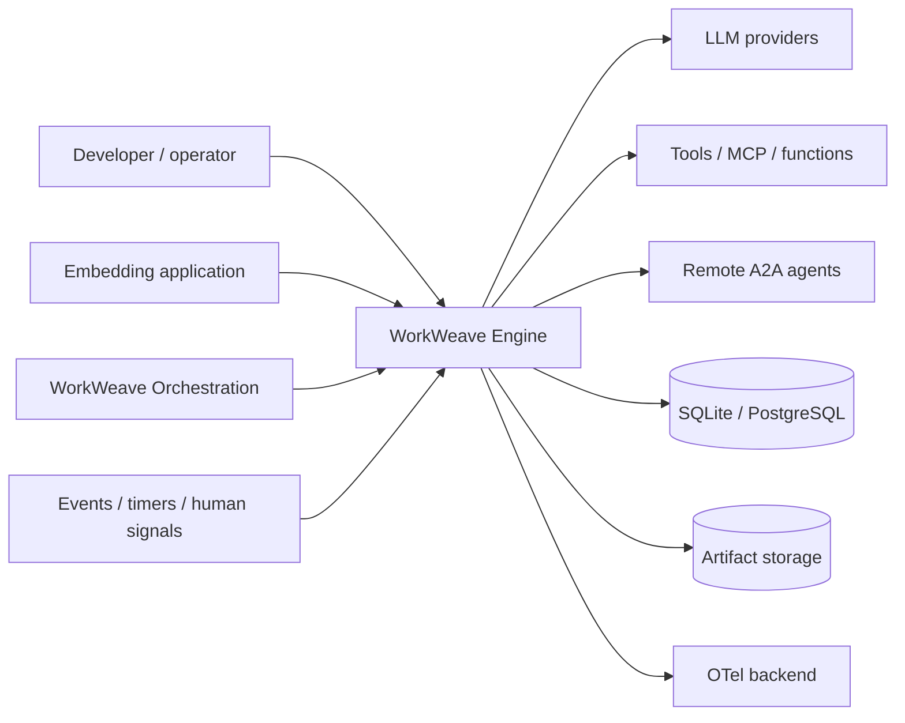

### 3.1 External actors and contracts

| Actor/system | Sends | Receives | Trust boundary |
| --- | --- | --- | --- |
| Developer/operator | prompts, workflow definitions, signals, cancel/approve commands | streams, results, logs, artifacts | authenticated caller and workspace policy |
| Embedding application | typed SDK requests | handles, streams, snapshots | in-process capability boundary |
| WorkWeave Orchestration | bounded Agent/Flow requests with correlation | terminal result and audit links | semantic authority remains outside engine |
| LLM provider | streamed deltas, usage, tool calls, errors | normalized model request | credentials, data disclosure, vendor availability |
| Tool/MCP/function | progress, outputs, errors | validated input and scoped capability | filesystem, process, network, secret effects |
| Remote A2A agent | correlated task status/result | A2A request/cancel | remote identity, retries, duplicate delivery |
| Event/timer producer | CloudEvent or internal wakeup | acknowledgement | correlation, replay, ordering, authenticity |
| Store | committed state | transaction requests | durability and concurrency |
| Telemetry backend | no engine authority | sampled logs/traces/metrics | may be unavailable or sampled |

---

## 4. C2 — container architecture

### 4.1 Logical containers

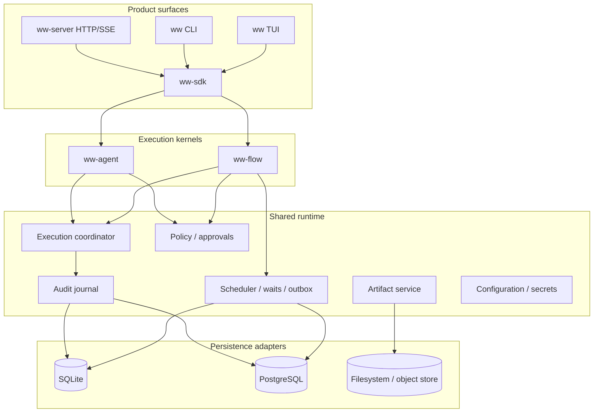

### 4.2 Deployment forms

#### Embedded

One process contains SDK, Agent, Flow, scheduler, and SQLite. This is the first implementation profile and the default for CLI/TUI use.

#### Local daemon

`ww serve` owns the database, scheduler, providers, and tools. CLI/TUI connect over local HTTP/SSE or a Unix socket. This removes database multi-writer concerns from interactive clients.

#### Coordinated server

Stateless API replicas and leased Agent/Flow workers coordinate through PostgreSQL. Large artifacts live in object storage. The scheduler uses row locking and fencing tokens.

#### Remote execution mesh

Flows can invoke remote A2A/MCP/function endpoints. Remote execution is an adapter; it does not change the Flow interpreter or Agent kernel.

---

## 5. C3 — shared runtime components

| Component | Owns | Main input | Main output | Failure rule |
| --- | --- | --- | --- | --- |
| Execution Registry | stable execution identity, kind, parent/root links, lifecycle summary | create/transition command | `ExecutionRecord` | illegal transition rejects |
| Transaction Coordinator | atomic writes across engine state, audit, outbox, inbox | typed mutation closure | committed version/position | no partial visible state |
| Audit Journal | ordered immutable execution events | `NewExecutionEvent` | durable sequence and stream tail | audit append is in state transaction |
| Event Stream Hub | live fan-out and replay cursor | committed audit events + ephemeral deltas | SSE/SDK/TUI stream | slow clients cannot block engine |
| Cancellation Tree | parent/child cancellation and deadlines | cancel/deadline | cancellation token and events | terminal records remain explicit |
| Budget Meter | token, cost, tool, time, step limits | reservations and usage | remaining budget/denial | reserve before expensive work |
| Policy Engine | capability and approval decisions | effect descriptor + principal/context | allow/deny/approval | default deny for undeclared effects |
| Artifact Service | content-addressed large payloads | bytes/stream/reference | digest-bearing `ArtifactRef` | metadata commit follows durable content |
| External Execution Manager | child identity, outbox dispatch, inbox dedupe, result correlation | external invocation plan | child result or durable wait | at-least-once, idempotent receipt |
| Scheduler | ready executions, timers, retries, leases | committed wakeups | leased work | fencing rejects stale workers |
| Definition Registry | immutable OWS source and compiled cache | source bytes | accepted definition/ref | source digest never mutates |
| Secret Resolver | scoped secret handles | provider/tool request | ephemeral credential | secret values never enter ordinary events |
| Telemetry Bridge | OTel spans, logs, metrics | committed and live events | exporter traffic | never controls correctness |
| Clock/ID Service | deterministic-testable time and IDs | request | timestamp, UUIDv7/ULID | injectable in tests |

### 5.1 The common abstraction must remain thin

The runtime can normalize lifecycle and inspection, but not internal semantics.

```rust
pub enum ExecutionKind {
    AgentRun,
    FlowInstance,
    ToolExecution,
    FunctionCall,
    McpCall,
    A2aCall,
    ChildFlow,
}

pub enum ExecutionStatus {
    Pending,
    Running,
    Waiting,
    Succeeded,
    Failed,
    Cancelled,
    TimedOut,
    BudgetExhausted,
    PolicyDenied,
    RequiresIntervention,
}
```

`ExecutionStatus` is an operational projection. Agent and Flow keep stricter state machines in their own crates.

### 5.2 Shared execution handle

```rust
pub struct ExecutionHandle<R> {
    pub id: ExecutionId,
    pub events: BoxStream<'static, Result<ExecutionEvent, StreamError>>,
    pub result: BoxFuture<'static, Result<R, ExecutionError>>,
    pub control: ExecutionControl,
}

#[async_trait]
pub trait ExecutionControlPort: Send + Sync {
    async fn cancel(&self, id: ExecutionId, reason: CancelReason) -> Result<(), ControlError>;
    async fn signal(&self, id: ExecutionId, signal: Signal) -> Result<(), ControlError>;
}
```

This handle is suitable for SDK, CLI, TUI, and server adapters. It does not imply a common Agent/Flow algorithm.

---

## 6. C3 — WorkWeave Agent components

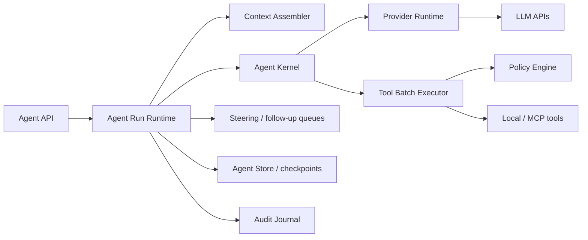

| Component | Responsibility |
| --- | --- |
| Agent Run Runtime | Creates one run, snapshots configuration, owns cancellation/settlement, coordinates persistence and the functional kernel. |
| Agent Kernel | Implements the small model → tool → model loop over provider-neutral types. |
| Context Assembler | Selects and converts Agent messages, system instructions, tool schemas, attachments, and compaction summaries into a model request. |
| Provider Runtime | Resolves provider/model/capabilities/auth, sends requests, normalizes streaming events, and records usage. |
| Tool Registry | Resolves stable tool name/version to schema, effect declaration, replay policy, and implementation. |
| Tool Batch Executor | Validates/preflights all calls, selects sequential/parallel execution, emits progress, and preserves result ordering. |
| Run Queues | Accepts steering during an active loop and follow-up work after a natural stop. |
| Agent Checkpointer | Persists stable turn/tool boundaries and reconstructable operation records. |
| Compaction Service | Produces derived summaries when model context limits require it; never rewrites the audit journal. |
| Agent Projector | Builds transcript, usage, pending-tool, and current-status views for SDK/CLI/TUI. |

---

## 7. C3 — WorkWeave Flow components

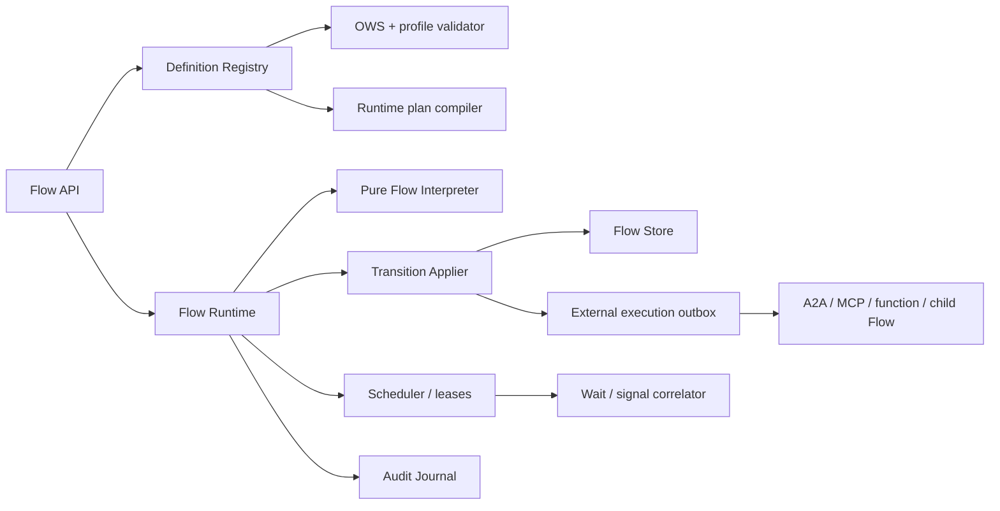

| Component | Responsibility |
| --- | --- |
| Definition Registry | Retains exact OWS bytes, digest, metadata, profile report, and optional compiled plan. |
| OWS Schema Validator | Validates OWS 1.0.3 syntax against the pinned official schema. |
| WorkWeave Profile Validator | Rejects unsupported task/call/expression semantics with a precise capability reason. |
| Runtime Plan Compiler | Creates an immutable internal lookup/index tied to source digest, profile, and compiler version. |
| Flow Interpreter | Purely determines the next `StepPlan` from definition + durable snapshot. |
| Transition Applier | Checks versions/lease fencing and atomically writes instance/token/context/wait/audit/outbox changes. |
| Token Scheduler | Leases ready tokens and timed wakeups without changing workflow semantics. |
| Expression Engine | Evaluates strict `jq` expressions against explicit OWS scopes. |
| Wait Correlator | Matches event, timer, child, and external execution causes to an exact waiting token. |
| External Execution Manager | Dispatches A2A, MCP, functions, and child workflows through durable outbox/inbox records. |
| Flow Projector | Builds current positions, branch tree, iteration state, waits, and execution history for clients. |

---

## 8. C4 — Rust workspace and dependency rules

### 8.1 Target workspace

```text
crates/
  ww-types/                 stable IDs, time, digests, errors, envelopes
  ww-runtime/               execution lifecycle, handles, cancellation, budgets
  ww-audit/                 durable event vocabulary, projections, stream cursors
  ww-store/                 repository and transaction ports
  ww-store-sqlite/          embedded implementation and migrations
  ww-store-postgres/        coordinated implementation and migrations
  ww-policy/                effect descriptors, decisions, approvals
  ww-artifacts/             content-addressed artifact service
  ww-secrets/               scoped secret references and resolvers
  ww-external/              outbox/inbox, dispatch, child correlation

  ww-agent-core/            Agent domain model, reducer, functional loop
  ww-agent-provider/        normalized model/provider protocol and registry
  ww-agent-openai/          first concrete provider adapter
  ww-agent-anthropic/       second provider adapter after core conformance
  ww-agent-tools/           tool contracts, registry, batch executor
  ww-agent-tools-local/     read/search/write/patch/process implementations

  ww-flow-core/             Flow state, pure interpreter, transition plans
  ww-flow-ows/              OWS ingest, validation, profile, plan compilation
  ww-flow-jq/               strict expression adapter and conformance fixtures
  ww-flow-scheduler/        ready queue, timers, waits, leases
  ww-flow-executors/        A2A, MCP, function, and child-flow adapters

  ww-sdk/                   public in-process Rust façade
  ww-server/                HTTP/SSE control plane and local daemon
  ww-cli/                   ww executable and machine-readable output
  ww-tui/                   Ratatui application and projections
```

The first implementation should create fewer physical crates and split only when boundaries are exercised. A practical initial workspace is:

```text
ww-types
ww-runtime
ww-store-sqlite
ww-agent
ww-flow
ww-sdk
ww-cli
```

### 8.2 Dependency direction

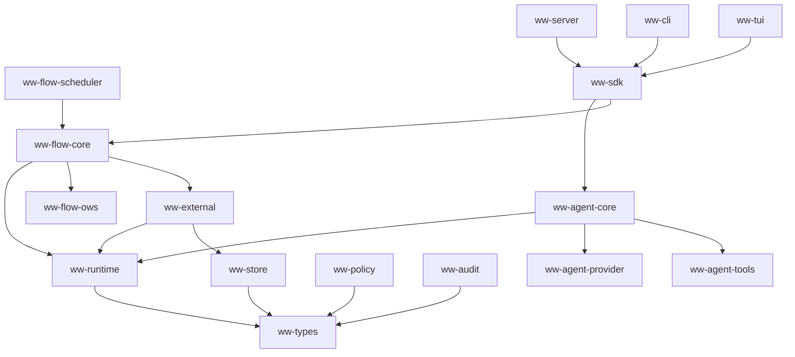

Hard rules:

- `ww-agent-core` does not depend on `ww-flow-core`.
- `ww-flow-core` does not depend on Agent messages, provider events, or tool internals.
- local Flow→Agent integration lives in an adapter crate that implements the external A2A executor port.
- store adapters depend on storage ports and record DTOs, not on CLI/TUI.
- UI and transport crates consume projectors/SDKs and never mutate tables directly.
- provider adapters do not emit vendor SDK types into `ww-agent-core`.
- compiled OWS plan types remain internal to `ww-flow-ows`/`ww-flow-core` and cannot be accepted as authored definitions.

### 8.3 Rust technology baseline

**WW proposed:**

- Tokio for async tasks, cancellation propagation, timers, channels, and subprocesses.
- `serde`/`serde_json` for versioned wire and persistence DTOs.
- `schemars` for deriving model-visible JSON Schema from Rust tool argument types.
- `jsonschema` for dynamic schema validation at provider/tool boundaries.
- `reqwest` behind one low-level HTTP client factory; providers and remote executors do not each invent TLS/proxy/retry behavior.
- `sqlx` for the first SQLite and PostgreSQL adapters so transaction semantics share one async programming model.
- `tracing` + OpenTelemetry for non-authoritative operational telemetry.
- Ratatui for the terminal interface.
- a pinned `jq` implementation or process adapter selected through conformance tests; do not write a partial expression evaluator casually.

Crate versions are an implementation-time decision and must be pinned after a compatibility and supply-chain review.

---

## 9. Shared operational domain model

### 9.1 Execution aggregate

```rust
pub struct ExecutionRecord {
    pub id: ExecutionId,
    pub kind: ExecutionKind,
    pub root_id: ExecutionId,
    pub parent_id: Option<ExecutionId>,
    pub correlation_id: CorrelationId,
    pub tenant_id: Option<TenantId>,
    pub status: ExecutionStatus,
    pub created_at: DateTime<Utc>,
    pub started_at: Option<DateTime<Utc>>,
    pub finished_at: Option<DateTime<Utc>>,
    pub deadline: Option<DateTime<Utc>>,
    pub configuration_digest: Digest,
    pub result_ref: Option<ArtifactRef>,
    pub error: Option<ExecutionFailure>,
    pub version: u64,
}
```

Invariants:

- `root_id == id` for a root execution; descendants retain the same root.
- parent and child kinds are explicit; a tool execution is not hidden inside an Agent row.
- terminal status never returns to a non-terminal status.
- every state-changing commit increments `version`.
- status summaries can be rebuilt from engine-specific state and events; they are not a substitute for Agent or Flow state.

### 9.2 Durable event envelope

```rust
pub struct ExecutionEvent {
    pub id: EventId,
    pub execution_id: ExecutionId,
    pub root_id: ExecutionId,
    pub parent_execution_id: Option<ExecutionId>,
    pub sequence: u64,
    pub occurred_at: DateTime<Utc>,
    pub engine: EngineKind,
    pub kind: EventKind,
    pub payload_version: u16,
    pub visibility: EventVisibility,
    pub trace: TraceContext,
    pub payload: JsonValue,
}
```

Required properties:

- `sequence` is monotonic and gap-tolerant per execution; ordering across executions uses event ID/time plus parent links, not an assumed global total order.
- event kind and payload version are stable API fields.
- large request/response bodies use `ArtifactRef` instead of unbounded inline JSON.
- secret material is redacted before event construction.
- live streams use committed event cursors; transient token deltas may be separately flagged as non-durable.

### 9.3 Attempts and external executions

```rust
pub struct AttemptRecord {
    pub execution_id: ExecutionId,
    pub attempt: u32,
    pub lease_generation: u64,
    pub started_at: DateTime<Utc>,
    pub finished_at: Option<DateTime<Utc>>,
    pub outcome: Option<AttemptOutcome>,
}

pub struct ExternalExecutionRecord {
    pub id: ExternalExecutionId,
    pub owner_execution_id: ExecutionId,
    pub owner_token_id: Option<FlowTokenId>,
    pub target: ExternalTarget,
    pub request_ref: ArtifactRef,
    pub idempotency_key: String,
    pub replay_policy: ReplayPolicy,
    pub status: ExternalExecutionStatus,
    pub remote_id: Option<String>,
    pub result_ref: Option<ArtifactRef>,
    pub version: u64,
}

pub enum ReplayPolicy {
    Never,
    Safe,
    Idempotent { key: String },
}
```

This replay policy adapts Pi Harness's durable distinction between unsafe and safely replayable tool work. It is mandatory for tool and external execution types that can survive process restart.

### 9.4 Budget model

```rust
pub struct ResourceBudget {
    pub wall_time: Option<Duration>,
    pub model_requests: Option<u32>,
    pub input_tokens: Option<u64>,
    pub output_tokens: Option<u64>,
    pub estimated_cost_micros: Option<u64>,
    pub tool_calls: Option<u32>,
    pub flow_steps: Option<u32>,
    pub child_executions: Option<u32>,
}
```

Budget updates use reservations:

1. reserve before starting expensive work;
2. reconcile with actual usage after completion;
3. release unused reservation;
4. reject a request that cannot fit the remaining budget;
5. record both reservation and actual usage for audit.

This avoids races when parallel tools or Flow branches consume the same parent budget.

### 9.5 Cancellation model

Cancellation is a durable command plus a live token:

```text
caller requests cancellation
        |
        v
commit cancel_requested event and reason
        |
        +--> signal local CancellationToken
        |
        +--> enqueue child cancellations
        |
        +--> prevent new work reservations
        |
        v
workers settle in-flight work and commit terminal outcomes
```

Cancellation is cooperative. The runtime must distinguish:

- request accepted;
- cancellation delivered;
- child acknowledged;
- effect could not be cancelled;
- execution settled as cancelled, failed, or requires intervention.

---

## 10. WorkWeave Agent domain model

### 10.1 Core concepts

| Concept | Meaning | Durable? |
| --- | --- | ---: |
| `AgentDefinition` | versioned instructions, default model, tool set, limits, and policy profile | yes |
| `AgentRun` | one bounded execution of an Agent request | yes |
| `AgentSession` | optional conversational lineage across runs | yes when enabled |
| `AgentContext` | ordered model-facing messages and attachments for one request | checkpointed |
| `AgentMessage` | provider-neutral user, assistant, or tool-result content | yes at stable boundaries |
| `ModelRequest` | normalized inference request plus exact configuration snapshot | yes or artifact-referenced |
| `ModelResponse` | finalized normalized assistant response and usage | yes |
| `ModelDelta` | transient streamed update | live by default; optional durable capture |
| `ToolCall` | model-requested name and arguments | yes |
| `ToolExecution` | policy decision, attempt, progress summary, and result | yes |
| `SteeringMessage` | input injected before the next model turn | durable queue entry |
| `FollowUpMessage` | input applied after the Agent would otherwise stop | durable queue entry when sessions are enabled |
| `Compaction` | derived summary replacing older context in the model view | yes as a context entry; original audit remains |
| `AgentRunResult` | terminal output, usage, artifact links, and disposition | yes |

### 10.2 Agent Run state machine

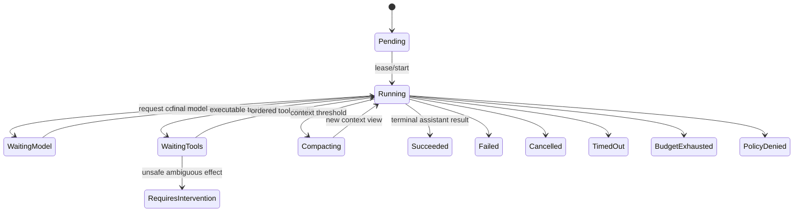

`WaitingModel` and `WaitingTools` may be operational substates rather than public statuses. They must nevertheless be recoverable from durable records.

### 10.3 Message model

```rust
pub enum AgentMessage {
    User(UserMessage),
    Assistant(AssistantMessage),
    ToolResult(ToolResultMessage),
    Custom(CustomAgentMessage),
}

pub struct AssistantMessage {
    pub content: Vec<AssistantContent>,
    pub provider: ProviderId,
    pub model: ModelId,
    pub stop_reason: StopReason,
    pub usage: Usage,
    pub error: Option<ModelFailure>,
}

pub enum AssistantContent {
    Text { text: String },
    ReasoningSummary { text: String },
    ToolCall(ToolCall),
    Attachment(ArtifactRef),
}
```

Hidden chain-of-thought is not a required content type. Provider reasoning summaries can be retained only when the provider legitimately returns them and policy allows storage.

### 10.4 Agent invariants

- only one active mutation lease may own an Agent Run;
- each model request has one finalized normalized response or one terminal request error;
- a tool result references exactly one prior tool call ID;
- model-visible tool results preserve call order even if safe calls execute concurrently;
- a `length`-truncated assistant response never causes tool execution from possibly incomplete arguments;
- finalized messages are immutable; corrections create new entries/events;
- a run terminal event is emitted only after durable state is committed;
- SDK/TUI settlement occurs after subscribed durable event handlers have observed the terminal event or detached cleanly.

---

## 11. WorkWeave Flow domain model

### 11.1 Canonical Flow concepts

**WW canonical:** WorkWeave Flow 0.5.0 admits two durable Flow entities:

- `FlowInstance` — one durable execution of one exact accepted OWS definition;
- `FlowToken` — one durable concurrent or waiting execution position.

Runtime values are:

- `WorkflowRef`;
- `WorkflowPosition`;
- `WorkflowContextState`;
- `ExecutionLineage`;
- `WaitState`.

The engine implements their persistence and runtime behavior without changing their conceptual ownership. See the pinned [Flow model](https://github.com/misawsneto/ww-orchestration/blob/21aac374d28e6ad39944214866780a74b39f8e24/docs/orchestration/flow/model.yaml) and [generated reference](https://github.com/misawsneto/ww-orchestration/blob/21aac374d28e6ad39944214866780a74b39f8e24/docs/orchestration/flow/MODEL.md).

### 11.2 Runtime-only concepts

| Concept | Purpose | Authority |
| --- | --- | --- |
| `AcceptedWorkflow` | exact source bytes, metadata, profile report, and digest | source bytes remain authority |
| `CompiledWorkflowPlan` | indexed task paths and pre-parsed expressions | disposable cache |
| `FlowSnapshot` | transactionally consistent instance, token, context, children, and completed results | derived read set |
| `StepPlan` | pure interpreter output describing one intended transition | not durable authority until applied |
| `TransitionSet` | version-checked state mutations and events | transaction input |
| `ExternalInvocation` | durable child request and wait intent | execution record |
| `Wakeup` | scheduler-ready token/time/result reference | derived/queue state |
| `FlowCheckpoint` | compact recovery snapshot | optimization; source state/event history remains authoritative |

### 11.3 Flow states

```rust
pub enum FlowInstanceState {
    Running,
    Waiting,
    Completed,
    Cancelled,
    Failed,
}

pub enum FlowTokenState {
    Ready,
    Active,
    Waiting,
    Consumed,
    Cancelled,
    Failed,
}

pub enum WaitKind {
    Event,
    Time,
    NestedWorkflow,
    ExternalExecution,
}
```

### 11.4 Flow invariants

- `WorkflowRef` is immutable after instance start;
- each active token position resolves unambiguously in the pinned definition;
- a consumed token never reactivates;
- branch and iteration lineage is preserved across child tokens;
- a waiting token resumes only from a matching, deduplicated cause;
- a terminal instance has no active, ready, or waiting tokens;
- workflow context follows OWS input/output/export/set behavior and has no WorkWeave Domain authority;
- unsupported OWS semantics fail closed;
- workflow completion does not complete a WorkWeave Task or achieve a Goal.

---

## 12. Pi architecture analysis and WorkWeave adaptation

### 12.1 Production package topology

**Pi observed:** Pi separates provider-neutral inference (`pi-ai`), a generic stateful Agent and functional loop (`pi-agent-core`), the coding-agent product/session layer, and TUI/protocol/client/server packages. The server accepts a host-supplied session service rather than constructing the coding agent itself. This validates separate execution, product composition, presentation, and remote-session seams.

Sources:

- [root workspace](https://github.com/earendil-works/pi/blob/6c87d9a026677b601e8278030dcf1ad97fe0bd86/package.json#L1-L64)
- [`pi-agent-core` manifest](https://github.com/earendil-works/pi/blob/6c87d9a026677b601e8278030dcf1ad97fe0bd86/packages/agent/package.json)
- [`pi-ai` manifest](https://github.com/earendil-works/pi/blob/6c87d9a026677b601e8278030dcf1ad97fe0bd86/packages/ai/package.json)
- [`pi-coding-agent` manifest](https://github.com/earendil-works/pi/blob/6c87d9a026677b601e8278030dcf1ad97fe0bd86/packages/coding-agent/package.json)
- [server contracts](https://github.com/earendil-works/pi/blob/6c87d9a026677b601e8278030dcf1ad97fe0bd86/packages/server/src/types.ts#L1-L63)

**WW adaptation:** keep the functional Agent kernel independent of product session/TUI/server concerns. Put provider selection, policy, persistence, project resources, and UI projection around the kernel rather than inside it.

### 12.2 Functional Agent loop

**Pi observed:** `runAgentLoop` copies the starting context, emits Agent and turn events, then enters a nested loop. The inner loop processes steering, provider streaming, tool calls, and tool results. The outer loop admits follow-up messages after the Agent would naturally stop. Provider error or abort ends the run. Sources:

- [loop entry and lifecycle](https://github.com/earendil-works/pi/blob/6c87d9a026677b601e8278030dcf1ad97fe0bd86/packages/agent/src/agent-loop.ts#L32-L150)
- [nested control loop](https://github.com/earendil-works/pi/blob/6c87d9a026677b601e8278030dcf1ad97fe0bd86/packages/agent/src/agent-loop.ts#L156-L270)

The core algorithm is intentionally small:

```text
append input
emit run/turn start
repeat:
    apply queued steering
    request model stream
    finalize assistant message
    if response failed or aborted: terminate
    if no tool calls: finish turn
    else:
        validate and preflight calls
        execute allowed calls
        append ordered tool results
    run stop/prepare-next-turn policy
until no follow-up exists
emit terminal run event
```

**WW adaptation:** preserve this functional structure. Keep persistence, policy, budget, and audit as explicit services invoked at stable boundaries; do not turn the kernel into a large object graph.

### 12.3 Provider seam and streaming assembly

**Pi observed:** `StreamFn` abstracts provider streaming and expects provider/request/runtime failures to become stream/final-message errors rather than ordinary unhandled promise rejection. At the call boundary, Pi transforms application messages into provider-neutral LLM messages, resolves the API key, streams partial events into one mutable partial assistant message, then replaces it with the final message. Sources:

- [`StreamFn` contract](https://github.com/earendil-works/pi/blob/6c87d9a026677b601e8278030dcf1ad97fe0bd86/packages/agent/src/types.ts#L18-L32)
- [provider boundary and response assembly](https://github.com/earendil-works/pi/blob/6c87d9a026677b601e8278030dcf1ad97fe0bd86/packages/agent/src/agent-loop.ts#L279-L370)

**WW adaptation:** use a Rust stream of typed `ModelEvent` values. Provider adapters may return a setup error before streaming, but once a stream starts, every path must yield either a finalized response or a terminal stream error that the Agent records as a normalized response failure.

### 12.4 Tool lifecycle and ordering

**Pi observed:** Pi validates arguments, runs a preflight hook, executes the tool with progress updates, runs an after hook, and converts tool failures into model-visible tool-result messages. A batch runs sequentially if globally configured or if any tool requires sequential execution; otherwise preflight remains ordered while allowed calls execute concurrently and results are emitted in original call order. A response truncated for token length causes all included tool calls to fail rather than execute possibly incomplete arguments. Sources:

- [batch selection and sequential path](https://github.com/earendil-works/pi/blob/6c87d9a026677b601e8278030dcf1ad97fe0bd86/packages/agent/src/agent-loop.ts#L372-L485)
- [parallel preflight and ordered results](https://github.com/earendil-works/pi/blob/6c87d9a026677b601e8278030dcf1ad97fe0bd86/packages/agent/src/agent-loop.ts#L487-L552)
- [prepare/validate/preflight](https://github.com/earendil-works/pi/blob/6c87d9a026677b601e8278030dcf1ad97fe0bd86/packages/agent/src/agent-loop.ts#L598-L666)
- [execution and postflight](https://github.com/earendil-works/pi/blob/6c87d9a026677b601e8278030dcf1ad97fe0bd86/packages/agent/src/agent-loop.ts#L668-L755)
- [tool result normalization](https://github.com/earendil-works/pi/blob/6c87d9a026677b601e8278030dcf1ad97fe0bd86/packages/agent/src/agent-loop.ts#L775-L788)

**WW adaptation:** retain the lifecycle and ordering semantics, add centralized effect policy and durable `ToolExecution` records, and require an explicit replay policy for recovery.

### 12.5 Stateful Agent façade and settlement

**Pi observed:** the `Agent` class owns current state, queues, one active run, cancellation, and listeners. It creates immutable context/config snapshots for the functional loop. Event listeners are awaited in registration order. `agent_end` means the loop emitted no more events, while the Agent becomes idle only after listeners settle and runtime-owned state is cleared. Sources:

- [state and options](https://github.com/earendil-works/pi/blob/6c87d9a026677b601e8278030dcf1ad97fe0bd86/packages/agent/src/agent.ts#L61-L238)
- [queue and cancellation API](https://github.com/earendil-works/pi/blob/6c87d9a026677b601e8278030dcf1ad97fe0bd86/packages/agent/src/agent.ts#L240-L330)
- [prompt/continue invariants](https://github.com/earendil-works/pi/blob/6c87d9a026677b601e8278030dcf1ad97fe0bd86/packages/agent/src/agent.ts#L347-L388)
- [snapshot and loop configuration](https://github.com/earendil-works/pi/blob/6c87d9a026677b601e8278030dcf1ad97fe0bd86/packages/agent/src/agent.ts#L409-L483)
- [run lifecycle and event reduction](https://github.com/earendil-works/pi/blob/6c87d9a026677b601e8278030dcf1ad97fe0bd86/packages/agent/src/agent.ts#L486-L590)

**WW adaptation:** separate durable event commit from presentation listeners. The engine is settled when terminal state/event is committed. A client handle is settled after its stream/projector drains through that committed terminal cursor.

### 12.6 Session tree and compaction

**Pi observed:** the production coding-agent `SessionManager` stores append-oriented JSONL entries with IDs and parent IDs, creating a navigable history tree. Branching changes the active leaf rather than rewriting old history. Compaction and branch summaries alter the model-facing context view while preserving prior entries. Source: [session entry model and manager](https://github.com/earendil-works/pi/blob/6c87d9a026677b601e8278030dcf1ad97fe0bd86/packages/coding-agent/src/core/session-manager.ts#L30-L170), [tree/index and persistence lifecycle](https://github.com/earendil-works/pi/blob/6c87d9a026677b601e8278030dcf1ad97fe0bd86/packages/coding-agent/src/core/session-manager.ts#L845-L1049).

**WW adaptation:** preserve append-oriented conversation lineage and branchable context as an Agent-session feature, but do not use product JSONL as the canonical transaction store for Flow tokens, outbox records, and cross-execution audit.

### 12.7 Pi Harness future architecture

**Pi observed:** the newer Harness source separates durable session **entries** from operational **lane records**. Records include operation start/finish, step attempts, started tools, queues, deferred writes, abort requests, and usage. A pure reducer reconstructs open operations and rejects impossible histories, including multiple open operations, nonconsecutive attempts, tool-call mismatches, duplicate invocations, and invalid deferred handles. Sources:

- [entry and record types](https://github.com/earendil-works/pi/blob/6c87d9a026677b601e8278030dcf1ad97fe0bd86/packages/agent/src/harness/session/types.ts#L14-L212)
- [storage and repository ports](https://github.com/earendil-works/pi/blob/6c87d9a026677b601e8278030dcf1ad97fe0bd86/packages/agent/src/harness/session/types.ts#L290-L393)
- [reducer state and corruption checks](https://github.com/earendil-works/pi/blob/6c87d9a026677b601e8278030dcf1ad97fe0bd86/packages/agent/src/harness/reducer.ts#L22-L109)
- [pure reduction entry](https://github.com/earendil-works/pi/blob/6c87d9a026677b601e8278030dcf1ad97fe0bd86/packages/agent/src/harness/reducer.ts#L505-L667)

The public Harness façade is incomplete at the pinned revision: restore, prompt, compact, resume, abort, queue, lane, watch, hook, and event operations still report `HarnessNotImplemented`. Source: [Harness façade](https://github.com/earendil-works/pi/blob/6c87d9a026677b601e8278030dcf1ad97fe0bd86/packages/agent/src/harness/agent-harness.ts).

**WW adaptation:** adopt the entry/record separation, pure recovery reducer, corruption rejection, and explicit replay safety. Do not claim Harness behavior as proven production behavior and do not mirror its API before WorkWeave needs it.

### 12.8 Pi preserve/adapt/reject table

| Pattern | Decision | WorkWeave treatment |
| --- | --- | --- |
| Small functional model/tool loop | Preserve | core of `ww-agent-core` |
| Provider-neutral stream seam | Preserve | typed Rust stream and capability model |
| Tool validation + pre/post hooks | Preserve/adapt | policy and durable execution wrap hooks |
| Parallel execution with ordered results | Preserve | deterministic result ordering |
| Steering/follow-up queues | Adapt | optional session feature, durable when enabled |
| Append-only session tree | Adapt | conversation lineage, not universal runtime store |
| Compaction as context projection | Preserve | summaries never erase audit |
| Stateful product mega-session | Simplify | smaller composition services |
| Dynamic TypeScript extension surface | Defer/reject initially | Rust traits first; process/WASI later |
| Harness entries + operational records | Preserve conceptually | separate semantic conversation from execution records |
| Harness public API as production reference | Reject | incomplete scaffold |
| Provider breadth | Defer | one provider, then conformance-driven expansion |

---

## 13. LangGraph architecture analysis and WorkWeave adaptation

### 13.1 Construction API versus runtime

**LangGraph observed:** `StateGraph` is a user-facing graph whose nodes read shared state and return partial updates. The compiled execution runtime is Pregel. WorkWeave must separate those two ideas: the Pregel runtime mechanics are useful, but OWS—not a WorkWeave `StateGraph` API—remains the authored Flow definition.

Sources:

- [`StateGraph`](https://github.com/langchain-ai/langgraph/blob/11ee185999b86bfea2d8c0e69cef9a5e37acf686/libs/langgraph/langgraph/graph/state.py)
- [`Pregel`](https://github.com/langchain-ai/langgraph/blob/11ee185999b86bfea2d8c0e69cef9a5e37acf686/libs/langgraph/langgraph/pregel/main.py)

### 13.2 Plan–execute–update barrier

**LangGraph observed:** Pregel applies a Bulk Synchronous Parallel model:

1. plan the actors selected by current triggers;
2. execute selected actors concurrently;
3. keep their writes invisible during execution;
4. apply writes at the update barrier;
5. repeat until no actor is selected or the step limit is reached.

The source describes this directly in [`Pregel`](https://github.com/langchain-ai/langgraph/blob/11ee185999b86bfea2d8c0e69cef9a5e37acf686/libs/langgraph/langgraph/pregel/main.py#L300-L430). `PregelRunner` separately owns concurrent task execution, retry, result commit, timeout, and interruption of sibling tasks when required. See [`_runner.py`](https://github.com/langchain-ai/langgraph/blob/11ee185999b86bfea2d8c0e69cef9a5e37acf686/libs/langgraph/langgraph/pregel/_runner.py#L95-L310).

**WW adaptation:** Flow should use a conceptually similar barrier, but over OWS tasks and `FlowToken`s rather than generic actors/channels:

```text
PLAN
  load one consistent Flow snapshot
  resolve each ready token against pinned OWS
  calculate pure StepPlan values

EXECUTE
  evaluate pure expressions immediately
  execute independent internal plans
  create durable intents for external plans

COMMIT
  apply context/token/instance changes atomically
  append audit events
  write outbox and wakeups
```

For external effects, “execute then update” is unsafe. WorkWeave persists intent/wait/outbox during the commit barrier and dispatches afterward. This is the major adaptation from in-memory graph actor execution to durable workflow automation.

### 13.3 Checkpoint model

**LangGraph observed:** a checkpoint contains values, channel versions, versions seen, pending sends, and updated-channel information. `CheckpointTuple` also carries configuration, metadata, parent configuration, and pending writes. `BaseCheckpointSaver` provides get, list, put, and put-writes operations. A `thread_id` identifies the durable lineage used for resume, interrupt continuation, and time-travel inspection. See [`checkpoint/base/__init__.py`](https://github.com/langchain-ai/langgraph/blob/11ee185999b86bfea2d8c0e69cef9a5e37acf686/libs/checkpoint/langgraph/checkpoint/base/__init__.py).

**WW adaptation:** use three related but distinct persistence forms:

- normalized current rows for efficient scheduling and control;
- append-only audit events for explanation and traceability;
- periodic engine-specific snapshots/checkpoints for fast recovery.

A Flow checkpoint includes the instance version, all nonterminal token versions, context digest/reference, child/wait references, and the event cursor that produced it. An Agent checkpoint includes finalized messages/context entries, open operation/tool state, usage, and event cursor. Checkpoints are optimizations and recovery anchors, not a second source of authored truth.

### 13.4 Pending writes and commit ordering

**LangGraph observed:** `PregelLoop` tracks pending writes and explicitly prevents a checkpoint from becoming durable before the writes that produced it. The implementation also separates loop state, tasks, checkpoint metadata, pending writes, interrupt statuses, and nested namespaces. See [`_loop.py`](https://github.com/langchain-ai/langgraph/blob/11ee185999b86bfea2d8c0e69cef9a5e37acf686/libs/langgraph/langgraph/pregel/_loop.py).

**WW adaptation:** all state needed to justify the next execution step must be committed no later than the checkpoint/event cursor that exposes that step. In particular:

- an external call outbox row and its waiting token commit together;
- an inbox result and token resumption commit together;
- an Agent tool-start record commits before an unsafe tool effect starts;
- a terminal status and terminal audit event commit together;
- a snapshot cursor never points beyond the durable events/state it summarizes.

### 13.5 Durability modes

**LangGraph observed:** LangGraph exposes `sync`, `async`, and `exit` durability. `sync` persists before the next step, `async` persists concurrently with the next step, and `exit` persists only when the graph exits. See [`types.py`](https://github.com/langchain-ai/langgraph/blob/11ee185999b86bfea2d8c0e69cef9a5e37acf686/libs/langgraph/langgraph/types.py#L60-L86).

**WW adaptation:** expose durability policy, but use safe defaults by engine and effect class:

| Work | Default | Allowed relaxation |
| --- | --- | --- |
| Flow token/context movement | synchronous | none before external effects/waits |
| Flow pure in-memory batch | synchronous at step barrier | batched commit within one step |
| Agent finalized model response | synchronous before tools | optional asynchronous transcript mirror only |
| Agent safe read-only tool progress | live/ephemeral | durable completion required |
| Agent unsafe tool start/result | synchronous | none around effect boundary |
| Token-level model deltas | ephemeral | opt-in durable diagnostic capture |
| One-shot non-durable Agent API | explicit `best_effort` profile | never used by durable Flow invocation |

### 13.6 Interrupts and resume

**LangGraph observed:** interrupts are first-class typed output, appear in state snapshots, and resume through checkpointed thread state. Stream payloads distinguish values, updates, messages, checkpoints, tasks, custom data, and debug data. See [`types.py`](https://github.com/langchain-ai/langgraph/blob/11ee185999b86bfea2d8c0e69cef9a5e37acf686/libs/langgraph/langgraph/types.py).

**WW adaptation:** use explicit suspension causes rather than exceptions as durable state:

```rust
pub enum SuspensionCause {
    AwaitingEvent(EventWait),
    AwaitingTime(TimeWait),
    AwaitingApproval(ApprovalWait),
    AwaitingExternal(ExternalExecutionId),
    AwaitingChild(ExecutionId),
    RequiresIntervention(InterventionReason),
}
```

An API may use control-flow errors internally, but the transaction converts them into a committed wait/suspension record before returning control.

### 13.7 Scoped nested execution

**LangGraph observed:** checkpointer namespaces and scoped stream transformers keep subgraph state and stream events distinguishable. WorkWeave should retain explicit parent/root identity and scoped event paths. It should not adopt opaque graph namespace strings as the only durable relation.

```rust
pub struct ExecutionPath {
    pub root: ExecutionId,
    pub ancestors: Vec<ExecutionId>,
    pub current: ExecutionId,
}
```

Nested Flow uses `run.workflow`. Flow→Agent uses A2A. Each child has an independent execution row and event sequence, and the parent has a typed child/wait reference.

### 13.8 LangGraph preserve/adapt/reject table

| Pattern | Decision | WorkWeave treatment |
| --- | --- | --- |
| Plan/execute/update barrier | Preserve/adapt | OWS token plans and transaction barrier |
| Concurrent independent work | Preserve | branches/tools with deterministic join/result order |
| Checkpoint lineage and parent link | Preserve | engine-specific snapshots with event cursor |
| Pending writes before checkpoint | Preserve | transaction ordering invariant |
| Interrupt/resume | Preserve | typed durable waits/suspensions |
| Multiple stream views | Preserve | stable event envelope plus projections |
| Retry/timeout per task | Preserve | explicit policy on Agent tools/Flow calls |
| Scoped nested execution | Preserve | parent/root IDs and child executions |
| Generic channels/reducers | Simplify/reject initially | typed OWS context deltas and token transitions |
| StateGraph authored DSL | Reject for Flow | OWS remains authority |
| Checkpoint as audit history | Reject | audit and snapshot are separate |
| Pure BSP external-effect semantics | Adapt | outbox/inbox and idempotency required |

---

## 14. Agent implementation algorithm

### 14.1 Public start transaction

`AgentService::start` must perform one transaction:

1. validate the Agent definition, model, tool versions, caller, and request schema;
2. resolve a policy profile and budget without loading secret values;
3. allocate root/parent/correlation IDs;
4. write `ExecutionRecord(Pending)` and `AgentRunRecord` with an immutable configuration snapshot digest;
5. append `agent.run.created`;
6. enqueue the run or claim it in embedded mode;
7. commit;
8. return an `ExecutionHandle` whose stream starts at the created event cursor.

### 14.2 Run acquisition

A worker:

1. atomically acquires a lease and fencing generation;
2. transitions Pending → Running;
3. appends `agent.run.started` with provider/model/tool pins and redacted limits;
4. reconstructs the latest checkpoint plus later records;
5. rejects corrupt or ambiguous state before contacting a provider.

### 14.3 Functional loop pseudocode

```text
function run_agent(snapshot, services, cancel):
    context = reconstruct_context(snapshot)
    pending_steering = drain_steering(snapshot.queue_policy)

    loop:
        check_cancel_deadline_budget()

        if previous_turn exists:
            preparation = prepare_next_turn(previous_turn, context)
            context = preparation.context
            model = preparation.model_override ?? model
            pending_steering += drain_steering_if_needed()

        append pending_steering to context and audit

        request = assemble_model_request(context, model, tool_specs)
        response = execute_model_request_durably(request)

        if response.stop_reason in [error, aborted]:
            finish_from_model_failure(response)
            return

        calls = response.tool_calls
        if calls is empty:
            turn = commit_turn(response, [])
        else if response.stop_reason == length:
            results = fail_all_as_truncated(calls)
            turn = commit_turn(response, results)
        else:
            prepared = validate_and_preflight(calls)
            results = execute_batch(prepared)
            turn = commit_turn(response, results)

        if stop_policy(turn, budget, cancel):
            break

        if turn has executable tool results:
            continue

        followups = drain_followups()
        if followups is empty:
            break
        append followups to context

    commit terminal result and event
```

The loop is deterministic except for model output and external tool effects. Given recorded responses/results, a replay reducer must reconstruct the same Agent state.

### 14.4 Model request transaction boundary

Before the network request:

- reserve budget;
- write a `ModelRequestRecord` with provider/model, normalized request digest, redacted configuration, and attempt number;
- append `agent.model.requested`;
- commit.

During streaming:

- publish transient deltas to the live stream with bounded buffering;
- optionally capture compressed diagnostic chunks under an explicit audit policy;
- do not mutate the canonical message list for every token.

At finalization:

- validate stream closure and tool-call structure;
- write finalized normalized response, usage, provider request ID, and optional encrypted raw-payload artifact;
- reconcile the budget reservation;
- append `agent.model.completed` or `agent.model.failed`;
- commit before executing any tool call from that response.

### 14.5 Stream assembly state machine

```rust
pub enum ModelStreamState {
    AwaitingStart,
    Streaming {
        text: String,
        reasoning_summary: String,
        tool_calls: BTreeMap<ToolCallId, ToolCallBuilder>,
        usage: PartialUsage,
    },
    Completed(ModelResponse),
    Failed(ProviderFailure),
}
```

Validation rules:

- a delta cannot precede stream start;
- tool argument fragments must resolve to one valid JSON value at completion;
- duplicate finalization is a protocol error;
- missing terminal usage is allowed only when provider capability declares it unavailable;
- a network disconnect before finalization produces a failed request, never an implicitly successful partial message;
- provider adapters preserve raw stop reason but map it to a stable `StopReason` enum.

### 14.6 Tool batch algorithm

```text
prepare every call in source order:
    resolve pinned tool
    parse and validate arguments
    derive effect descriptor
    ask centralized policy
    persist requested + policy decision

if any prepared tool requires sequential mode:
    execute calls in source order
    stop launching later calls when cancellation or batch termination applies
else:
    execute allowed calls concurrently under a bounded semaphore
    collect completion independently
    emit model-visible results in original call order

run postflight normalization for each result
commit turn with assistant response + ordered tool results
```

Policy denial normally becomes a model-visible error result so the model can adjust. A caller-selected strict policy may terminate the run instead.

### 14.7 Agent terminal result

```rust
pub struct AgentRunResult {
    pub disposition: AgentDisposition,
    pub output: Vec<AgentContent>,
    pub final_message_id: Option<AgentMessageId>,
    pub usage: UsageSummary,
    pub artifacts: Vec<ArtifactRef>,
    pub warnings: Vec<RunWarning>,
}
```

Terminal commit atomically writes the result, status, usage summary, terminal event, and child completion notification/outbox record.

---

## 15. Provider architecture

### 15.1 Normalized provider contract

```rust
pub type ModelEventStream =
    Pin<Box<dyn Stream<Item = Result<ModelEvent, ProviderError>> + Send + 'static>>;

#[async_trait]
pub trait ModelProvider: Send + Sync {
    fn id(&self) -> ProviderId;
    fn capabilities(&self, model: &ModelId) -> ModelCapabilities;

    async fn stream(
        &self,
        request: ModelRequest,
        context: ProviderContext,
    ) -> Result<ModelEventStream, ProviderError>;
}

pub enum ModelEvent {
    Started { provider_request_id: Option<String> },
    TextDelta { text: String },
    ReasoningSummaryDelta { text: String },
    ToolCallStarted { id: ToolCallId, name: String },
    ToolCallArgumentsDelta { id: ToolCallId, fragment: String },
    ToolCallCompleted { id: ToolCallId },
    UsageUpdated(PartialUsage),
    Completed { stop_reason: ProviderStopReason },
}
```

### 15.2 Model registry

A model record must be configuration data, not a giant hard-coded enum:

```rust
pub struct ModelDescriptor {
    pub provider: ProviderId,
    pub id: ModelId,
    pub context_window: u64,
    pub max_output_tokens: Option<u64>,
    pub capabilities: ModelCapabilities,
    pub pricing: Option<Pricing>,
    pub compatibility: JsonValue,
    pub catalog_revision: String,
}
```

A run snapshots the exact descriptor or its digest. Catalog updates do not silently change an active run.

### 15.3 Provider request preparation

The Provider Runtime, not the Agent kernel, owns:

- endpoint selection;
- credential reference resolution;
- provider/model compatibility flags;
- HTTP headers and organization/project IDs;
- proxy/TLS/timeouts;
- provider-specific message conversion;
- retry classification;
- raw response capture policy;
- provider request IDs and usage normalization.

Pi's separate `ModelRuntime` demonstrates the value of keeping provider catalog/auth/request preparation outside the functional loop. Source: [`model-runtime.ts`](https://github.com/earendil-works/pi/blob/6c87d9a026677b601e8278030dcf1ad97fe0bd86/packages/coding-agent/src/core/model-runtime.ts).

### 15.4 Retry policy

Retry only requests that are safe to repeat and have not produced a semantically accepted final response. Recommended classes:

| Failure | Default |
| --- | --- |
| connect timeout before request body accepted | retry with jitter |
| 429 / retryable quota | retry within deadline and budget |
| 5xx before stream content | retry |
| disconnect after content/tool-call deltas | fail attempt; restart only under explicit provider replay policy |
| authentication / invalid request | do not retry |
| context overflow | invoke compaction policy, then create a new request attempt |
| caller cancellation | do not retry |

Every retry is a new attempt with the same logical model operation ID and its own provider request record.

### 15.5 Secret handling

- records store `SecretRef`, never secret values;
- resolution occurs immediately before dispatch;
- provider/tool child tasks receive only scoped credentials;
- logs and errors pass through redaction before persistence;
- raw request capture is off by default and, when enabled, encrypted under a separate retention policy;
- a TUI/API cannot read secret values back from the engine.

---

## 16. Tool architecture

### 16.1 Tool contract

```rust
#[async_trait]
pub trait Tool: Send + Sync {
    fn identity(&self) -> ToolIdentity;
    fn spec(&self) -> ToolSpec;
    fn effect(&self, arguments: &JsonValue) -> Result<EffectDescriptor, ToolError>;
    fn execution_mode(&self) -> ToolExecutionMode;
    fn replay_policy(&self, arguments: &JsonValue) -> ReplayPolicy;

    async fn execute(
        &self,
        request: ToolRequest,
        context: ToolContext,
        progress: ToolProgressSink,
    ) -> Result<ToolOutput, ToolError>;
}
```

### 16.2 Tool identity and schema

```rust
pub struct ToolIdentity {
    pub namespace: String,
    pub name: String,
    pub version: Version,
    pub implementation_digest: Option<Digest>,
}

pub struct ToolSpec {
    pub identity: ToolIdentity,
    pub description: String,
    pub input_schema: JsonSchema,
    pub output_schema: Option<JsonSchema>,
}
```

Agent definitions pin allowed tool identities. A changed tool implementation or schema does not silently alter a durable run.

### 16.3 Effect descriptor and policy

```rust
pub enum EffectDescriptor {
    ReadFile { path: PathBuf },
    WriteFile { path: PathBuf },
    SpawnProcess { program: String, args: Vec<String> },
    NetworkRequest { host: String, method: String },
    McpCall { server: String, method: String },
    Custom { kind: String, attributes: JsonValue },
}

pub enum PolicyDecision {
    Allow { constraints: EffectConstraints },
    Deny { reason: String },
    RequireApproval { request: ApprovalRequest },
}
```

The policy engine sees the principal, project trust state, Agent definition, tool identity, normalized arguments, effect descriptor, workspace, parent Flow/Orchestration context, and remaining budget.

### 16.4 Initial local tool set

Start with:

- `fs.read` — read-only, bounded bytes, path-root enforcement;
- `fs.search` — read-only, bounded matches, no shell injection;
- `fs.patch` — workspace write, expected-content/hash precondition, atomic replace;
- `process.run` — explicit executable/arguments, controlled cwd/env, timeout, output truncation/artifact spill.

Do not start with a general unbounded shell string if the first architecture slice can prove the loop with structured process execution. A later `shell.run` can be an explicitly high-risk tool.

### 16.5 Output and truncation

```rust
pub struct ToolOutput {
    pub content: Vec<ToolContent>,
    pub details: JsonValue,
    pub artifacts: Vec<ArtifactRef>,
    pub usage: ToolUsage,
    pub termination: ToolTermination,
}
```

Large stdout, files, patches, and binary data move to artifacts. The model-visible result receives a bounded summary plus artifact metadata. Truncation must be explicit in both the result and audit event.

### 16.6 Crash recovery for tools

On startup, reduce open tool executions:

| Durable state | Replay policy | Recovery |
| --- | --- | --- |
| requested, not started | any | schedule normally |
| started, no result | `Safe` | retry with new attempt |
| started, no result | `Idempotent(key)` | query/retry with same key |
| started, no result | `Never` | mark `RequiresIntervention` |
| completed, parent turn not committed | any | reuse durable result; do not rerun |
| result committed and turn committed | any | continue next model turn |

This is one of the most important reasons to persist tool execution independently from the message transcript.

---

## 17. Agent persistence, recovery, queues, and compaction

### 17.1 Separate context entries from operational records

Adapt the Pi Harness split:

```text
Agent context entries                 Agent operational records
----------------------------------    ----------------------------------
user/assistant/tool-result message    run/operation started
model change                          model request attempt
thinking/config change                tool requested/started/completed
compaction summary                    queue enqueued/consumed/cancelled
branch summary                        abort requested
custom context entry                  usage/budget reservation
                                      run/operation finished
```

Context entries determine what the model can see. Operational records determine what the runtime did and whether it can safely resume. Neither should be reconstructed by scraping the other.

### 17.2 Reducer

```rust
pub trait AgentReducer {
    fn reduce(
        checkpoint: Option<&AgentCheckpoint>,
        records: &[AgentRecord],
    ) -> Result<AgentRecoveryState, CorruptAgentHistory>;
}
```

The reducer validates:

- at most one open run operation per run;
- consecutive attempt numbers;
- one terminal response per model request;
- tool calls match the finalized assistant message;
- each tool result matches a prior started call;
- no duplicate terminal run record;
- queue consumption references an existing unconsumed entry;
- checkpoint cursor does not exceed available records;
- unsafe ambiguous effects become intervention, not guessed completion.

A reducer failure is data corruption or a migration problem. Do not synthesize a plausible state and continue.

### 17.3 Checkpoint cadence

Checkpoint after:

- input/context entry commit;
- finalized model response;
- completed tool batch/turn;
- compaction;
- terminal run.

Do not checkpoint every text delta. The live stream can expose deltas while a reconnecting client resumes from the latest committed semantic boundary.

### 17.4 Steering and follow-up queues

```rust
pub struct QueuedAgentInput {
    pub id: QueueEntryId,
    pub run_id: AgentRunId,
    pub mode: QueueMode,
    pub message: AgentMessage,
    pub created_at: DateTime<Utc>,
    pub consumed_at: Option<DateTime<Utc>>,
    pub cancelled_at: Option<DateTime<Utc>>,
}

pub enum QueueMode {
    Steering,
    FollowUp,
}
```

Steering is consumed before the next model request. Follow-up is consumed only after the current turn would otherwise end. A queue policy controls whether one or all available entries are drained. Queue state is persisted when the run is durable or remotely controlled.

### 17.5 Compaction

Compaction creates a new context entry containing:

- source message range/entry IDs;
- summary text or structured summary;
- model/provider used for compaction when probabilistic;
- token estimates before/after;
- artifact references;
- provenance digest.

Original messages and model/tool audit events remain. The context assembler follows the active lineage and substitutes the compaction entry for the covered range.

Compaction policy belongs around the Agent kernel:

```text
estimate next request size
    |
    +-- within model limit --> continue
    |
    +-- over soft threshold --> compact then continue
    |
    +-- provider reports overflow --> compact/retry if policy permits
    |
    +-- cannot compact safely --> fail with context_exhausted
```

---

## 18. OWS definition ingestion and compilation

### 18.1 Authority pipeline

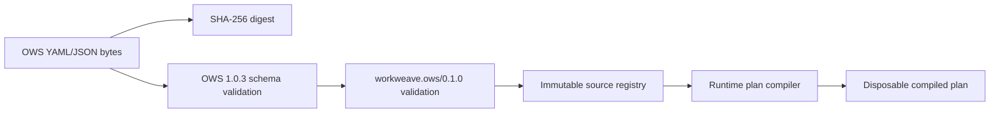

One acceptance operation:

1. receive raw source bytes and media type;
2. compute digest before normalization;
3. parse with source locations retained;
4. validate against the pinned OWS schema;
5. validate the frozen WorkWeave profile;
6. reject unsupported features with structured capability codes;
7. resolve document identity: DSL version, namespace, name, version;
8. store immutable source, digest, validation report, and schema/profile pins;
9. compile an internal plan keyed by `(source_digest, profile_version, compiler_version)`;
10. return `WorkflowRef`.

A caller may upload identical bytes repeatedly; the operation is idempotent by digest.

### 18.2 Accepted definition record

```rust
pub struct WorkflowDefinitionRecord {
    pub id: WorkflowDefinitionId,
    pub dsl_version: String,
    pub namespace: String,
    pub name: String,
    pub version: String,
    pub source_digest: Digest,
    pub source_artifact: ArtifactRef,
    pub media_type: String,
    pub schema_pin: SourcePin,
    pub profile_id: String,
    pub profile_version: String,
    pub validation_report: ValidationReport,
    pub accepted_at: DateTime<Utc>,
}
```

A unique constraint should prevent two different source digests from claiming the same accepted namespace/name/version/profile unless the product explicitly supports immutable revision aliases. Prefer rejecting the collision.

### 18.3 Compiled plan

```rust
pub struct CompiledWorkflowPlan {
    pub source_digest: Digest,
    pub profile: ProfileRef,
    pub compiler_version: Version,
    pub entry: WorkflowPosition,
    pub tasks: BTreeMap<WorkflowPosition, CompiledTask>,
    pub transitions: BTreeMap<WorkflowPosition, TransitionIndex>,
    pub expression_pool: Vec<CompiledExpression>,
    pub source_map: SourceMap,
}
```

The compiler may:

- assign stable logical task paths;
- pre-resolve named `then` targets;
- index nested task blocks;
- parse jq expressions;
- precompute static terminal paths and reachability;
- attach source spans and task metadata.

The compiler may not:

- invent semantics not present in OWS/profile;
- serialize its plan as an alternative authoring format;
- let a running instance switch compiler output without a compatible migration;
- discard source locations needed for diagnostics.

### 18.4 `WorkflowPosition`

Use an explicit task path independent of array offsets alone. Example:

```text
/do/performWork
/do/evaluateWork/for/do/runEvaluation
/do/routeReview/switch/reviewRequired
```

The path must resolve in the pinned compiled plan. For repeated iterations/branches, position remains the authored task path while `ExecutionLineage` distinguishes dynamic instances.

### 18.5 Strict jq

The expression adapter receives an explicit environment:

```rust
pub struct ExpressionEnvironment<'a> {
    pub context: &'a JsonValue,
    pub workflow_input: &'a JsonValue,
    pub task_input: &'a JsonValue,
    pub task_output: Option<&'a JsonValue>,
    pub iteration: Option<&'a IterationBinding>,
    pub metadata: &'a RuntimeMetadata,
}
```

The adapter must define:

- exact variable bindings (`$context`, `$workflow`, iteration variables, current `.`);
- null/missing behavior;
- boolean coercion rules;
- numeric precision;
- deterministic time access: expressions do not read wall clock unless OWS/profile explicitly supplies a frozen value;
- resource limits for expression execution;
- error mapping with source spans.

Select the jq implementation only after running the canonical 12 workflows plus profile conformance fixtures. Unsupported or incompatible expression behavior fails closed.

---

## 19. Flow interpreter and transaction algorithm

### 19.1 Pure planning boundary

```rust
pub trait FlowInterpreter: Send + Sync {
    fn plan_step(
        &self,
        definition: &CompiledWorkflowPlan,
        snapshot: &FlowSnapshot,
    ) -> Result<StepPlan, FlowPlanError>;
}

pub enum StepPlan {
    ApplyContext(ContextTransition),
    Branch(BranchTransition),
    SpawnBranches(SpawnBranches),
    StartIteration(StartIteration),
    AdvanceIteration(AdvanceIteration),
    Suspend(SuspensionPlan),
    DispatchExternal(ExternalInvocationPlan),
    StartChildFlow(ChildFlowPlan),
    CompleteToken(TokenCompletion),
    CompleteInstance(FlowOutput),
    Fail(FlowFailure),
}
```

`plan_step` has no database, network, clock, random, or provider access. All nondeterministic values are supplied in the snapshot or created by the transaction coordinator after planning.

### 19.2 Worker algorithm

```text
lease one ready token with fencing generation
load instance, token, context, definition pin, child results, and waits
verify token version and position
compile/load exact plan

repeat within bounded local step budget:
    plan = interpreter.plan_step(plan, snapshot)

    if plan is pure internal transition:
        apply plan to in-memory snapshot
        accumulate transition batch
        if barrier reached: commit batch and refresh versions
        continue

    if plan requires external execution or wait:
        commit accumulated transitions + wait/child/outbox atomically
        release lease
        return WAITING

    if plan completes/fails token or instance:
        commit accumulated transitions + terminal state/event atomically
        release lease
        return TERMINAL/READY
```

A local batch may include adjacent pure `set` and `switch` steps, but every batch has a configured maximum and produces meaningful task-completion events. Never batch across an external effect, wait, fork/join boundary, cancellation observation, or checkpoint requirement.

### 19.3 Transition application

```rust
pub trait FlowTransaction {
    async fn apply(
        &mut self,
        expected: FlowExpectedVersions,
        lease: LeaseFence,
        transition: TransitionSet,
    ) -> Result<CommittedFlowTransition, FlowCommitError>;
}
```

The commit checks:

- instance/token versions still match;
- lease owner/generation is current;
- no cancellation request supersedes the plan;
- referenced workflow digest/compiler plan matches;
- wait/child IDs are unique;
- terminal invariants hold;
- event sequences and wakeups are allocated in the same transaction.

A conflict reloads and replans. It does not patch the old plan onto new state.

---

## 20. OWS profile task execution

The first frozen profile supports `call`, `for`, `fork`, `listen`, `run.workflow`, `set`, `switch`, named-task transitions, and `end`; A2A and MCP are native calls. See the pinned [WorkWeave OWS profile](https://github.com/misawsneto/ww-orchestration/blob/21aac374d28e6ad39944214866780a74b39f8e24/docs/orchestration/ows/profile.yaml) and [canonical task-cycle workflow](https://github.com/misawsneto/ww-orchestration/blob/21aac374d28e6ad39944214866780a74b39f8e24/docs/orchestration/workflows/task-cycle.yaml).

### 20.1 Common task wrapper

For each named OWS task, the compiler records:

- task path and source span;
- task kind;
- input mapping;
- body configuration;
- output/export mapping;
- `then` target or implicit next task;
- retry/timeout settings supported by the profile;
- task-level metadata that is non-semantic.

Execution order:

```text
resolve task input
execute task-kind semantics
produce task output
apply output mapping
apply export to workflow context
resolve then/end/implicit transition
commit task completion and next position
```

### 20.2 `set`

`set` is a pure context transition:

1. evaluate every declared assignment against one immutable pre-task environment unless OWS specifies ordered dependency;
2. validate resulting JSON values;
3. construct a context delta;
4. apply output/export semantics;
5. advance token.

The compiled task stores expression source and source spans. A jq failure produces a deterministic Flow failure with no partial context update.

### 20.3 `switch`

1. evaluate cases in authored order;
2. select the first matching case under strict boolean semantics;
3. resolve its `then` target;
4. if no case matches, apply the OWS/profile default behavior or fail explicitly;
5. commit the selected transition and audit the case key, not arbitrary hidden expression internals.

The result is deterministic because the context and expression engine are pinned.

### 20.4 `call:function`

A function call is treated as external execution even when implemented in-process if it can fail, block, or have effects:

1. evaluate request input;
2. create child `ExecutionRecord(FunctionCall)`;
3. create `ExternalExecutionRecord` and idempotency key;
4. place the token in `Waiting(ExternalExecution)`;
5. insert outbox entry;
6. commit;
7. dispatcher invokes the selected function adapter;
8. inbox result resumes the exact token;
9. output/export/transition apply in a new transaction.

A pure, explicitly registered deterministic function may execute inside the planning/apply transaction only when it is bounded, side-effect-free, and replayable.

### 20.5 `call:mcp`

MCP uses the same durable external-execution protocol. The adapter owns transport/session specifics. The Flow engine records server/tool identity, arguments digest, capability policy, idempotency behavior where available, progress summary, result/error, and artifacts.

### 20.6 `call:a2a`

A2A creates a child execution whose target can resolve to:

- local WorkWeave Agent;
- local registered external Agent implementation;
- remote A2A server.

The Flow interpreter sees only the A2A request/result contract. It never imports Agent message or tool types.

### 20.7 `for`

```rust
pub struct IterationLineage {
    pub parent_token: FlowTokenId,
    pub task_path: WorkflowPosition,
    pub index: u64,
    pub key: Option<String>,
    pub item_digest: Digest,
}
```

Algorithm:

1. evaluate the collection once when entering the loop;
2. persist a stable iteration snapshot or artifact reference;
3. create iteration lineage and child token(s) according to profile concurrency semantics;
4. bind the item/key into the expression environment;
5. execute the nested task block;
6. persist each iteration output independently;
7. aggregate outputs in deterministic source/index order;
8. apply loop export and advance the parent continuation.

A restart must not re-evaluate a mutable external collection and silently change membership.

### 20.8 `fork`

For the frozen profile, competing fork semantics are not enabled. Non-competing fork execution:

1. create a branch group ID;
2. consume or suspend the parent token at the fork boundary;
3. create one child token per branch with parent position and branch key;
4. execute branches concurrently;
5. persist branch output/context deltas separately;
6. join according to OWS semantics;
7. merge only through an explicit deterministic merge rule;
8. create the continuation token and consume branch tokens.

Do not allow last-writer-wins over shared mutable JSON by accident. The compiler must know each branch's export/output paths and either prove disjoint writes or invoke an explicit merge strategy.

### 20.9 `listen`

`listen` always commits a durable wait:

```rust
pub struct EventWait {
    pub event_type: String,
    pub correlation: JsonValue,
    pub consumption: EventConsumption,
    pub deadline: Option<DateTime<Utc>>,
}
```

The event inbox:

1. validates the event envelope and caller authenticity;
2. deduplicates by event/source ID;
3. queries indexed waiting correlations;
4. re-checks the correlation expression against the exact wait record;
5. atomically marks the event consumed for the wait, clears the wait, updates context, and readies the token;
6. leaves unmatched events available according to retention policy.

The canonical WorkWeave pattern is event-driven: a Domain change emits an event; the Flow resumes; the workflow re-reads Domain truth.

### 20.10 `run.workflow`

Nested workflow execution:

1. resolve and pin the exact child `WorkflowRef` before start;
2. create child Flow execution and parent-child link;
3. persist parent token wait and child creation atomically;
4. child executes under its own token/state machine;
5. terminal child result enters the parent inbox;
6. parent applies output/export and resumes;
7. parent cancellation propagates to child according to cancellation policy.

The child can outlive the parent only under an explicit detach policy, which is out of scope initially.

### 20.11 named transition and `end`

A named `then` resolves at compile time to one task path. `end` completes the current task block/token. Instance completion occurs only when no nonterminal token or unresolved child/wait remains and OWS block semantics allow completion.

---

## 21. Flow-to-Agent execution contract

### 21.1 Transport-neutral A2A port

```rust
#[async_trait]
pub trait A2aExecutor: Send + Sync {
    async fn dispatch(
        &self,
        request: A2aRequest,
        context: DispatchContext,
    ) -> Result<DispatchReceipt, DispatchError>;

    async fn cancel(
        &self,
        receipt: &DispatchReceipt,
        reason: CancelReason,
    ) -> Result<(), DispatchError>;
}
```

`DispatchReceipt` means the request was accepted or durably correlated, not that the Agent completed.

### 21.2 Local adapter

```rust
pub struct LocalWorkWeaveAgentAdapter {
    agent: Arc<AgentService>,
    inbox: Arc<dyn ExternalResultInbox>,
}

impl LocalWorkWeaveAgentAdapter {
    async fn dispatch_local(
        &self,
        call: ExternalExecutionRecord,
        request: A2aRequest,
    ) -> Result<DispatchReceipt, DispatchError> {
        let run = self.agent.start(map_to_agent_request(request), child_context(&call)).await?;
        register_completion_delivery(run, call.id, self.inbox.clone());
        Ok(DispatchReceipt::local(run.id))
    }
}
```

The mapping layer defines which A2A content becomes Agent input and which `AgentRunResult` fields become the A2A result. The Agent does not receive `FlowToken` internals.

### 21.3 Remote adapter

The remote adapter sends the same logical request with:

- stable external execution ID;
- idempotency key;
- callback/poll correlation;
- deadline;
- parent/root trace context;
- authentication and capability scope.

Network retries reuse the same idempotency key. A remote duplicate result is ignored after inbox deduplication.

### 21.4 Sequence

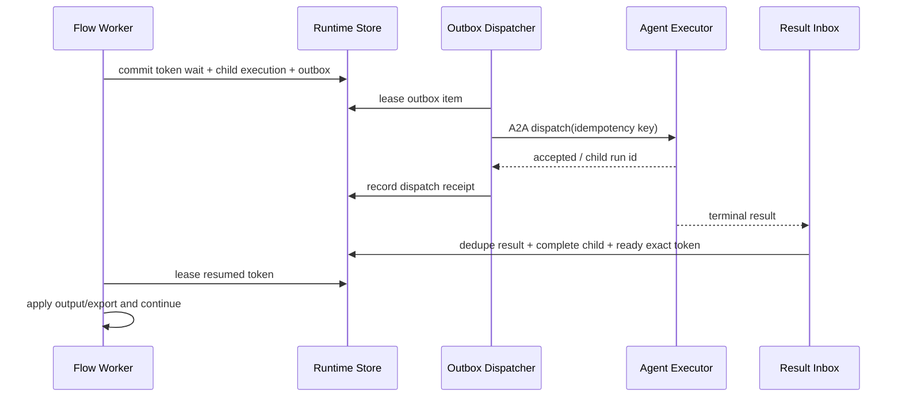

---

## 22. External execution, outbox, inbox, and crash windows

### 22.1 Outbox record

```rust
pub struct OutboxItem {
    pub id: OutboxId,
    pub execution_id: ExternalExecutionId,
    pub destination: Destination,
    pub payload_ref: ArtifactRef,
    pub idempotency_key: String,
    pub available_at: DateTime<Utc>,
    pub attempt: u32,
    pub lease: Option<Lease>,
    pub delivered_at: Option<DateTime<Utc>>,
}
```

### 22.2 Inbox record

```rust
pub struct InboxItem {
    pub source: String,
    pub message_id: String,
    pub external_execution_id: ExternalExecutionId,
    pub payload_ref: ArtifactRef,
    pub received_at: DateTime<Utc>,
    pub applied_at: Option<DateTime<Utc>>,
}
```

Unique `(source, message_id)` and external-result constraints prevent duplicate application.

### 22.3 Crash analysis

| Crash point | Durable state | Recovery |
| --- | --- | --- |
| before outbox commit | no child/wait | re-plan safely |
| after outbox commit, before dispatch | waiting token + pending outbox | dispatcher sends |
| after remote accepted, before receipt commit | pending outbox, remote may run | retry same idempotency key or query remote |
| after result received, before inbox commit | remote can redeliver/poller repeats | receive again |
| after inbox commit, before token ready commit | prohibited: same transaction | atomic apply |
| after token ready, before worker executes | ready token | scheduler leases it |
| Agent unsafe tool started, no result | explicit ambiguous record | intervention, not replay |
| child terminal, parent result delivery missing | terminal child + pending completion outbox | redeliver |

Exactly-once external execution is not assumed. The engine provides exactly-once **state application** through dedupe and transaction constraints, with at-least-once delivery.

---

## 23. Persistence architecture

### 23.1 Storage strategy

Use transactional current-state tables plus immutable event history. Do not force all reads through event replay, and do not allow current rows to change without corresponding durable events.

```text
command / interpreter plan
          |
          v
+---------------------------+
| one database transaction  |
|                           |
| current aggregate rows    |
| execution/audit events    |
| outbox/inbox              |
| wakeups/leases            |
+---------------------------+
          |
          v
live stream / scheduler / projectors
```

### 23.2 Logical schema

The following SQL is directional, not a frozen migration.

```sql
create table executions (
    id                  text primary key,
    kind                text not null,
    root_id             text not null,
    parent_id           text null,
    correlation_id      text not null,
    tenant_id           text null,
    status              text not null,
    configuration_digest text not null,
    result_artifact_id  text null,
    error_json          text null,
    created_at          text not null,
    started_at          text null,
    finished_at         text null,
    deadline            text null,
    version             integer not null
);

create index executions_root_idx on executions(root_id, created_at);
create index executions_parent_idx on executions(parent_id, created_at);
create index executions_status_idx on executions(status, created_at);

create table execution_events (
    id                  text primary key,
    execution_id        text not null,
    root_id             text not null,
    parent_execution_id text null,
    sequence            integer not null,
    occurred_at         text not null,
    engine              text not null,
    kind                text not null,
    payload_version     integer not null,
    visibility          text not null,
    trace_json          text not null,
    payload_json        text not null,
    unique(execution_id, sequence)
);

create index execution_events_root_idx
    on execution_events(root_id, occurred_at, id);

create table artifacts (
    id                  text primary key,
    digest              text not null unique,
    media_type          text not null,
    size_bytes          integer not null,
    storage_uri         text not null,
    encryption_json     text null,
    created_at          text not null,
    metadata_json       text not null
);

create table agent_runs (
    execution_id        text primary key,
    definition_ref      text not null,
    model_ref_json      text not null,
    tool_set_digest     text not null,
    context_head_id     text null,
    open_operation_json text null,
    usage_json          text not null,
    internal_state      text not null,
    version             integer not null
);

create table agent_entries (
    id                  text primary key,
    run_id              text not null,
    parent_id           text null,
    sequence            integer not null,
    kind                text not null,
    payload_json        text not null,
    created_at          text not null,
    unique(run_id, sequence)
);

create table agent_records (
    id                  text primary key,
    run_id              text not null,
    sequence            integer not null,
    kind                text not null,
    payload_json        text not null,
    created_at          text not null,
    unique(run_id, sequence)
);

create table workflow_definitions (
    id                  text primary key,
    dsl_version         text not null,
    namespace           text not null,
    name                text not null,
    version             text not null,
    source_digest       text not null unique,
    source_artifact_id  text not null,
    schema_pin_json     text not null,
    profile_id          text not null,
    profile_version     text not null,
    validation_json     text not null,
    accepted_at         text not null,
    unique(namespace, name, version, profile_id, profile_version)
);

create table compiled_workflows (
    source_digest       text not null,
    profile_version     text not null,
    compiler_version    text not null,
    plan_artifact_id    text not null,
    created_at          text not null,
    primary key(source_digest, profile_version, compiler_version)
);

create table flow_instances (
    execution_id        text primary key,
    workflow_definition_id text not null,
    source_digest       text not null,
    compiler_version    text not null,
    subject_json        text null,
    context_json        text not null,
    context_digest      text not null,
    internal_state      text not null,
    version             integer not null
);

create table flow_tokens (
    id                  text primary key,
    instance_id         text not null,
    position            text not null,
    state               text not null,
    parent_token_id     text null,
    lineage_json        text null,
    wait_json           text null,
    next_wake_at        text null,
    lease_owner         text null,
    lease_expires_at    text null,
    lease_generation    integer not null default 0,
    version             integer not null
);

create index flow_tokens_ready_idx
    on flow_tokens(state, next_wake_at, lease_expires_at);

create table external_executions (
    id                  text primary key,
    owner_execution_id  text not null,
    owner_token_id      text null,
    child_execution_id  text null,
    target_json         text not null,
    request_artifact_id text not null,
    idempotency_key     text not null,
    replay_policy_json  text not null,
    status              text not null,
    remote_id           text null,
    result_artifact_id  text null,
    version             integer not null,
    unique(owner_execution_id, idempotency_key)
);

create table outbox (
    id                  text primary key,
    external_execution_id text not null,
    destination_json    text not null,
    payload_artifact_id text not null,
    idempotency_key     text not null,
    available_at        text not null,
    attempt             integer not null,
    lease_owner         text null,
    lease_expires_at    text null,
    delivered_at        text null
);

create table inbox (
    source              text not null,
    message_id          text not null,
    external_execution_id text not null,
    payload_artifact_id text not null,
    received_at         text not null,
    applied_at          text null,
    primary key(source, message_id)
);

create table checkpoints (
    execution_id        text not null,
    checkpoint_id       text not null,
    parent_checkpoint_id text null,
    event_sequence      integer not null,
    state_artifact_id   text not null,
    schema_version      integer not null,
    created_at          text not null,
    primary key(execution_id, checkpoint_id)
);
```

SQLite stores timestamps as normalized UTC text or integers; PostgreSQL uses native `timestamptz` and JSONB. Storage adapters must present identical behavioral contracts.

### 23.3 Transaction matrix

| Operation | Must commit atomically |
| --- | --- |
| create execution | execution row + engine row + created event + initial queue |
| start Agent/Flow | lease/version + running state + started event |
| finalize model response | model response + usage reconciliation + response event |
| start unsafe tool | tool attempt + started event before effect |
| complete tool | result + usage + artifact refs + completed event |
| commit Agent turn | message/context entries + tool-result ordering + checkpoint + turn event |
| pure Flow step | context/token/instance versions + task event + next wakeup |
| external Flow call | external record + child execution + token wait + outbox + events |
| apply external result | inbox dedupe + external completion + token ready/context + events |
| cancel parent | cancel request + child cancel outbox + event |
| terminal execution | engine result + execution status + terminal event + parent notification |

### 23.4 SQLite profile

Use one writer transaction path and WAL mode. In embedded mode:

- one process owns the database;
- an async storage actor or bounded connection pool serializes mutations that touch the same execution;
- readers can inspect committed state concurrently;
- scheduler polling is local and simple;
- filesystem artifact writes use temporary file → fsync as configured → atomic rename → metadata transaction;
- backup uses SQLite online backup or a quiesced copy, never a raw copy during arbitrary writes.

The first slice does not need distributed leases, but the schema should retain version and generation fields so PostgreSQL semantics do not require a domain rewrite.

### 23.5 PostgreSQL profile

Use:

- `SELECT ... FOR UPDATE SKIP LOCKED` for ready work and outbox leasing;
- lease expiry plus monotonically increasing fencing generation;
- optimistic aggregate versions on commit;
- database-generated event ordering per execution;
- advisory locks only for coarse maintenance, not ordinary correctness;
- transactional outbox and inbox constraints;
- partition/retention strategy for high-volume events later.

A stale worker with generation `n` cannot commit after another worker acquires generation `n+1`, even if the stale worker completes an external call.

### 23.6 Snapshot and migration policy

Every persisted payload has an explicit schema version. Reducers migrate old record versions to the current in-memory form. Snapshot compatibility rules:

- code may read the current and declared previous versions;
- a migration writes a new checkpoint but never rewrites immutable historical events silently;
- unknown future event kinds remain inspectable and block state reduction only when required for correctness;
- compiled OWS plans are discarded and rebuilt when compiler version changes;
- running Flow instances stay pinned to a compatible compiler or undergo an explicit migration with validation.

---

## 24. Scheduler, leases, timers, and concurrency

### 24.1 Scheduler contract

```rust
#[async_trait]
pub trait WorkQueue: Send + Sync {
    async fn lease_ready(
        &self,
        worker: &WorkerId,
        kinds: &[ExecutionWorkKind],
        limit: usize,
        lease_for: Duration,
    ) -> Result<Vec<LeasedWork>, QueueError>;

    async fn heartbeat(&self, lease: &LeaseFence, extend: Duration) -> Result<(), QueueError>;
    async fn release(&self, lease: &LeaseFence, outcome: LeaseOutcome) -> Result<(), QueueError>;
}
```

### 24.2 Ready work

A work item is ready when:

- its engine-specific state permits execution;
- `next_wake_at <= now` or is null;
- no unexpired lease exists;
- parent cancellation/terminal state does not prohibit work;
- required child/external result is available;
- retry backoff has elapsed.

Readiness is a query/projection. The worker still validates all state after acquiring the lease.

### 24.3 Fairness and backpressure

The scheduler enforces:

- per-tenant and global concurrency limits;
- separate pools for Agent provider work, local tools, Flow transitions, and external dispatch;
- priority without permanent starvation;
- bounded queues and stream buffers;
- model/provider rate-limit feedback;
- child execution quotas to stop runaway fork/agent spawning.

### 24.4 Timer model

A time wait stores an absolute UTC deadline computed once from the pinned workflow context and clock. Scheduler wakeup only marks the token ready; the Flow interpreter re-checks wait state and current cancellation before advancing.

Clock access is injectable. Tests use a virtual clock and deterministic IDs.

### 24.5 Concurrency rules

- one Agent Run mutation lease at a time;
- one FlowToken mutation lease at a time;
- multiple independent tokens of one FlowInstance may execute concurrently;
- context merges occur only at explicit deterministic boundaries;
- one external execution result is applied once;
- one outbox item may be delivered more than once but must reuse its idempotency key;
- TUI/API readers never acquire mutation leases.

---

## 25. Audit, live streaming, and observability

### 25.1 Three different products

```text
DURABLE AUDIT JOURNAL
  correctness, explanation, history, replay cursor

LIVE EVENT STREAM
  low-latency SDK/CLI/TUI updates; committed events plus transient deltas

OPENTELEMETRY
  sampled/exported operational traces, logs, and metrics
```

Do not make one substitute for another.

### 25.2 Event taxonomy

#### Shared

```text
execution.created
execution.started
execution.cancel_requested
execution.waiting
execution.resumed
execution.completed
execution.failed
execution.requires_intervention
budget.reserved
budget.reconciled
policy.decision
artifact.created
```

#### Agent

```text
agent.input.appended
agent.turn.started
agent.model.requested
agent.model.delta            transient by default
agent.model.completed
agent.model.failed
agent.tool.requested
agent.tool.started
agent.tool.progress          transient/summary
agent.tool.completed
agent.tool.failed
agent.turn.completed
agent.compaction.started
agent.compaction.completed
agent.queue.enqueued
agent.queue.consumed
agent.run.completed
```

#### Flow

```text
flow.instance.started
flow.task.completed
flow.branch.spawned
flow.branch.joined
flow.iteration.started
flow.iteration.completed
flow.wait.started
flow.wait.resumed
flow.external.requested
flow.external.completed
flow.child.started
flow.child.completed
flow.instance.completed
```

The Flow audit records meaningful movement. Exhaustive provider/tool internals remain attached to child execution audit rather than being duplicated as Flow events.

### 25.3 Event visibility

```rust
pub enum EventVisibility {
    Public,
    Operator,
    Sensitive,
    Diagnostic,
}
```

- Public events can stream to ordinary callers.
- Operator events include policy and infrastructure diagnostics.
- Sensitive events require elevated authorization and remain redacted.
- Diagnostic events can be sampled/retained for shorter periods.

### 25.4 Redaction and retention

Redaction occurs before persistence and telemetry export. Rules operate over structured fields, not regular-expression cleanup of rendered strings alone.

Retention is class-specific:

- execution summaries and terminal results: long-lived;
- normalized messages/tool results: product policy;
- raw provider payloads: off by default, encrypted and short-lived when enabled;
- transient deltas/progress: live only or short diagnostic retention;
- secrets: never retained as values;
- artifact contents: independent lifecycle and access control.

### 25.5 Audit queries

The API must answer:

- which configuration/model/workflow/tool versions ran;
- why a tool or external action was allowed or denied;
- where a Flow is waiting and on which correlation;
- which Agent/Flow/Tool children belong to a root execution;
- whether an action was retried and with which idempotency key;
- what was known durably before a crash;
- which artifacts and workspace changes resulted;
- how tokens/cost/time were consumed;
- why the execution terminated.

### 25.6 Stream protocol

Clients subscribe with a cursor:

```http
GET /v1/runs/{id}/events?after=<event-id>&include=public,operator
Accept: text/event-stream
```

The server first replays committed events after the cursor, then tails new committed events. Transient deltas carry no durable cursor and may be lost on reconnect. A bounded per-client buffer drops/coalesces transient deltas before disconnecting a slow client; durable events are never silently skipped.

### 25.7 OpenTelemetry mapping

- root Agent/Flow execution → trace or root span;
- model request/tool/external call/Flow task → child span;
- execution/event IDs → span attributes;
- provider request ID and remote child ID → links;
- metrics → duration, queue lag, retries, tokens, cost, wait age, policy denials, failures;
- audit payloads are not copied wholesale into span attributes.

---

## 26. Policy, security, trust, and approvals

### 26.1 Trust boundaries

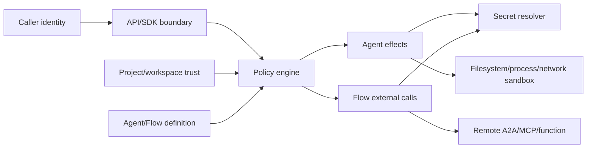

### 26.2 Policy request

```rust
pub struct PolicyRequest {
    pub principal: Principal,
    pub execution: ExecutionDescriptor,
    pub parent: Option<ExecutionDescriptor>,
    pub workspace: Option<WorkspaceDescriptor>,
    pub project_trust: ProjectTrust,
    pub effect: EffectDescriptor,
    pub requested_secrets: Vec<SecretRef>,
    pub remaining_budget: ResourceBudget,
}
```

### 26.3 Decision and constraints

```rust
pub struct EffectConstraints {
    pub filesystem_roots: Vec<PathBuf>,
    pub network_hosts: Vec<HostPattern>,
    pub max_duration: Option<Duration>,
    pub max_output_bytes: Option<u64>,
    pub environment_allowlist: Vec<String>,
    pub secret_scope: Vec<SecretRef>,
}
```

An `Allow` decision includes constraints enforced by the executor, not merely advisory text.

### 26.4 Approval flow

1. policy returns `RequireApproval` with a stable approval request ID and effect digest;
2. owner execution enters a durable approval wait;
3. API/TUI shows exact normalized effect and constraints;
4. approver grants/denies for one effect, a bounded scope, or a policy duration;
5. decision is committed and audit-linked;
6. executor revalidates that the effect digest and execution version still match;
7. changed arguments require a new approval.

Approval is execution governance, not WorkWeave Domain authority.

### 26.5 Project trust

Pi's project-trust mechanism demonstrates that resource discovery and extension activation should depend on a trust decision rather than automatically executing project-controlled configuration. WorkWeave should apply the same principle to:

- Agent instruction files;
- tool/plugin manifests;
- environment loading;
- local MCP servers;
- executable hooks;
- workflow-linked local functions.

A project can be `Untrusted`, `TrustedReadOnly`, or `Trusted`, with explicit provenance and revocation.

### 26.6 Sandboxing

First implementation:

- canonical workspace root resolution and symlink escape checks;
- structured subprocess execution with clean environment;
- no implicit network access;
- OS process-group cancellation;
- bounded stdout/stderr with artifact spill;
- explicit unsafe mode for hosts that cannot sandbox.

Later platform-specific adapters can use namespaces/seccomp, macOS sandbox profiles, Windows job objects/AppContainer, or containerized workers. The policy contract stays stable while enforcement adapters evolve.

### 26.7 Multi-tenancy

Server mode requires tenant ID on every execution, event, artifact, definition, secret reference, outbox/inbox record, and query predicate. Database row-level security may add defense in depth, but application authorization remains mandatory.

---

## 27. SDK architecture

### 27.1 Rust façade

```rust
pub struct WorkWeave {
    pub agent: AgentClient,
    pub flow: FlowClient,
    pub runs: RunClient,
    pub workflows: WorkflowClient,
    pub approvals: ApprovalClient,
}

let ww = WorkWeave::embedded(config).await?;

let agent = ww.agent.start(AgentRunRequest { /* ... */ }).await?;
let flow = ww.flow.start(FlowStartRequest { /* ... */ }).await?;

let mut events = ww.runs.events(agent.id, EventCursor::Beginning).await?;
while let Some(event) = events.next().await {
    // project or display
}
```

The same public client traits back embedded and remote implementations.

### 27.2 Agent API

```rust
impl AgentClient {
    async fn start(&self, request: AgentRunRequest) -> Result<ExecutionHandle<AgentRunResult>>;
    async fn append_steering(&self, run: AgentRunId, message: AgentMessage) -> Result<()>;
    async fn append_follow_up(&self, run: AgentRunId, message: AgentMessage) -> Result<()>;
    async fn cancel(&self, run: AgentRunId, reason: CancelReason) -> Result<()>;
    async fn snapshot(&self, run: AgentRunId) -> Result<AgentRunSnapshot>;
}
```

### 27.3 Flow API

```rust
impl FlowClient {
    async fn start(&self, request: FlowStartRequest) -> Result<ExecutionHandle<FlowResult>>;
    async fn signal(&self, instance: FlowInstanceId, signal: Signal) -> Result<SignalReceipt>;
    async fn cancel(&self, instance: FlowInstanceId, reason: CancelReason) -> Result<()>;
    async fn snapshot(&self, instance: FlowInstanceId) -> Result<FlowSnapshotView>;
}
```

### 27.4 Workflow API

```rust
impl WorkflowClient {
    async fn validate(&self, source: WorkflowSource) -> Result<ValidationReport>;
    async fn accept(&self, source: WorkflowSource) -> Result<WorkflowRef>;
    async fn get(&self, reference: WorkflowRef) -> Result<AcceptedWorkflowView>;
}
```

### 27.5 API stability

- domain types use exhaustive internal enums but wire DTOs include version fields and unknown-kind handling where appropriate;
- SDK error types separate validation, policy, conflict, provider, execution, storage, and transport failures;
- all create/start/signal APIs accept caller idempotency keys;
- client-side timeout does not imply server-side cancellation;
- handles expose both terminal result and event stream.

Python and TypeScript SDKs can be generated from the stable HTTP schema later. Do not bind public multi-language APIs directly to Rust memory layout.

---

## 28. Server and transport architecture

### 28.1 Initial protocol

Use JSON over HTTP plus SSE:

- easy to inspect and script;
- supports CLI/TUI/browser clients;
- stable OpenAPI contract;
- SSE fits one-way execution streams;
- ordinary POST endpoints handle steering, signals, approvals, and cancellation.

Use WebSocket later only when truly bidirectional low-latency interaction justifies it. Internal workers can coordinate through the database/outbox before introducing a custom RPC protocol.

### 28.2 Endpoint outline

```text
POST   /v1/agent-runs
GET    /v1/agent-runs/{id}
POST   /v1/agent-runs/{id}/steering
POST   /v1/agent-runs/{id}/follow-ups
POST   /v1/agent-runs/{id}/cancel

POST   /v1/workflows/validate
POST   /v1/workflows
GET    /v1/workflows/{namespace}/{name}/{version}

POST   /v1/flow-instances
GET    /v1/flow-instances/{id}
POST   /v1/flow-instances/{id}/signals
POST   /v1/flow-instances/{id}/cancel

GET    /v1/runs/{id}
GET    /v1/runs/{id}/events
GET    /v1/runs/{id}/tree
GET    /v1/runs/{id}/artifacts

GET    /v1/approvals
POST   /v1/approvals/{id}/decisions

GET    /health/live
GET    /health/ready
GET    /metrics
```

### 28.3 Idempotency

All mutating endpoints accept `Idempotency-Key`. The server stores key, principal, operation kind, request digest, and response reference. Reusing a key with a different digest rejects.

### 28.4 Concurrency control

Snapshot responses expose an ETag/version. Commands that depend on a current view may supply `If-Match`. The engine still validates internal versions transactionally.

### 28.5 A2A compatibility

The Flow A2A adapter can expose/consume the relevant A2A message/task contract at a dedicated endpoint or translation service. The internal Agent API does not have to become identical to A2A; the adapter maps between stable concepts and records correlation IDs.

---

## 29. CLI architecture

### 29.1 Command surface

```text
ww agent run [--model ...] [--tool ...] [--json] <prompt>
ww agent steer <run-id> <message>
ww agent follow-up <run-id> <message>
ww agent cancel <run-id>
ww agent inspect <run-id>

ww workflow validate <file>
ww workflow accept <file>
ww workflow show <ref>

ww flow run <file-or-ref> [--input file.json] [--json]
ww flow signal <instance-id> --type ... --data file.json
ww flow cancel <instance-id>
ww flow inspect <instance-id>

ww run inspect <id>
ww run events <id> [--follow] [--after cursor]
ww run tree <id>
ww run artifacts <id>

ww approvals list
ww approvals decide <id> --allow|--deny
ww serve
```

### 29.2 Output modes

- human output: concise status, progress, and terminal summary;
- `--json`: one final versioned object;
- `--jsonl`: streamed versioned event envelopes;
- exit codes distinguish validation, policy, execution failure, cancellation, timeout, and transport errors;
- secrets and sensitive event classes are never printed without explicit authorization.

### 29.3 Embedded versus remote

`ww` can open embedded SQLite directly or use `--server`. The command implementation talks only to SDK client traits, so behavior and output stay consistent.

---

## 30. TUI architecture

### 30.1 One shell, three projections

```text
+--------------------------------------------------------------+
| WorkWeave | runs | agent | flow | approvals | artifacts      |
+----------------------+---------------------------------------+
| execution tree       | selected execution                    |
|                      |                                       |
| flow                  | Agent transcript / Flow token graph  |
|  +- agent             | tool details / wait / context        |
|      +- tool          |                                       |
+----------------------+---------------------------------------+
| event timeline / logs / policy / usage / command palette     |
+--------------------------------------------------------------+
```

### 30.2 Component structure

```text
TuiApp
  AppStateReducer
  EventSubscription
  RunTreeProjection
  AgentProjection
  FlowProjection
  EventTimelineProjection
  ArtifactViewer
  ApprovalDialog
  CommandDispatcher
  TerminalRenderer
```

The TUI consumes SDK snapshots and streams. It never opens SQLite or mutates runtime records directly.

### 30.3 Agent view

- ordered transcript and streaming assistant content;
- provider/model/configuration pins;
- active/past tool calls with policy decisions;
- diff/artifact inspection;
- usage and budget;
- steering/follow-up input;
- cancel/approve controls;
- context/compaction lineage.

### 30.4 Flow view

- pinned workflow identity and source digest;
- current token positions mapped to source spans;
- branch/iteration tree;
- waits, deadlines, correlations, and signals;
- child Agent/Flow/tool executions;
- workflow context diff by meaningful task;
- retry/cancellation state;
- terminal output.

### 30.5 Rendering and stream rules

- UI state is a pure reduction of snapshots plus events;
- transient model deltas can update one in-progress message without entering durable history;
- reconnect starts from the last committed cursor;
- event bursts are coalesced before rendering;
- terminal resize/input failures do not affect execution correctness;
- a TUI crash never cancels a server-owned run unless explicitly requested.

---

## 31. Core Rust contracts

These are architectural contracts. They should compile early as contract tests, but are not frozen public APIs.

### 31.1 Typed identifiers

```rust
#[derive(Clone, Copy, Debug, Eq, PartialEq, Hash, Serialize, Deserialize)]
pub struct ExecutionId(Uuid);

#[derive(Clone, Copy, Debug, Eq, PartialEq, Hash, Serialize, Deserialize)]
pub struct AgentRunId(ExecutionId);

#[derive(Clone, Copy, Debug, Eq, PartialEq, Hash, Serialize, Deserialize)]
pub struct FlowInstanceId(ExecutionId);

#[derive(Clone, Copy, Debug, Eq, PartialEq, Hash, Serialize, Deserialize)]
pub struct FlowTokenId(Uuid);
```

Do not pass untyped strings throughout core code. Serialization remains string-compatible at API/storage boundaries.

### 31.2 Execution context

```rust
pub struct ExecutionContext {
    pub id: ExecutionId,
    pub root_id: ExecutionId,
    pub parent_id: Option<ExecutionId>,
    pub correlation_id: CorrelationId,
    pub principal: Principal,
    pub tenant_id: Option<TenantId>,
    pub deadline: Option<DateTime<Utc>>,
    pub budget: BudgetHandle,
    pub cancellation: CancellationToken,
    pub trace: TraceContext,
    pub policy_profile: PolicyProfileRef,
}
```

### 31.3 Transaction port

Avoid a generic closure trait that is difficult to make object-safe across async adapters. Expose a typed unit of work:

```rust
#[async_trait]
pub trait RuntimeStore: Send + Sync {
    async fn begin(&self) -> Result<Box<dyn RuntimeTx>, StoreError>;
    async fn load_execution(&self, id: ExecutionId) -> Result<ExecutionRecord, StoreError>;
    async fn events(
        &self,
        id: ExecutionId,
        after: Option<EventCursor>,
    ) -> Result<BoxStream<'static, Result<ExecutionEvent, StoreError>>, StoreError>;
}

#[async_trait]
pub trait RuntimeTx: Send {
    async fn get_execution_for_update(
        &mut self,
        id: ExecutionId,
    ) -> Result<ExecutionRecord, StoreError>;

    async fn put_execution(
        &mut self,
        expected_version: u64,
        record: &ExecutionRecord,
    ) -> Result<(), StoreError>;

    async fn append_event(
        &mut self,
        event: NewExecutionEvent,
    ) -> Result<ExecutionEvent, StoreError>;

    async fn put_outbox(&mut self, item: &OutboxItem) -> Result<(), StoreError>;
    async fn commit(self: Box<Self>) -> Result<(), StoreError>;
    async fn rollback(self: Box<Self>) -> Result<(), StoreError>;
}
```

Engine-specific repositories receive `&mut dyn RuntimeTx` so current state and common audit/outbox commit together.

### 31.4 Agent kernel port

```rust
#[async_trait]
pub trait AgentKernel: Send + Sync {
    async fn run(
        &self,
        state: AgentRecoveryState,
        services: AgentKernelServices,
    ) -> Result<AgentKernelOutcome, AgentError>;
}

pub struct AgentKernelServices {
    pub providers: Arc<dyn ProviderRegistry>,
    pub tools: Arc<dyn ToolRegistry>,
    pub policy: Arc<dyn PolicyEngine>,
    pub persistence: Arc<dyn AgentPersistence>,
    pub artifacts: Arc<dyn ArtifactStore>,
    pub clock: Arc<dyn Clock>,
    pub cancellation: CancellationToken,
}
```

The kernel calls persistence at explicit stable boundaries. Alternatively, it can emit typed effects to an outer runtime reducer; choose one style and keep it consistent. The first implementation should prefer explicit service methods over a premature free-monad/effect system.

### 31.5 Agent persistence port

```rust
#[async_trait]
pub trait AgentPersistence: Send + Sync {
    async fn commit_input(&self, run: AgentRunId, input: AgentMessage) -> Result<AgentEntryId, AgentStoreError>;
    async fn begin_model_request(&self, request: NewModelRequest) -> Result<ModelOperation, AgentStoreError>;
    async fn complete_model_request(&self, response: FinalizedModelResponse) -> Result<(), AgentStoreError>;
    async fn begin_tool(&self, tool: NewToolExecution) -> Result<ToolExecutionId, AgentStoreError>;
    async fn complete_tool(&self, result: FinalizedToolResult) -> Result<(), AgentStoreError>;
    async fn commit_turn(&self, turn: FinalizedTurn) -> Result<AgentCheckpointId, AgentStoreError>;
    async fn finish_run(&self, result: AgentRunResult) -> Result<(), AgentStoreError>;
}
```

Each method defines one transaction boundary and appends appropriate audit events.

### 31.6 Flow interpreter and applier

```rust
pub trait FlowInterpreter: Send + Sync {
    fn plan_step(
        &self,
        plan: &CompiledWorkflowPlan,
        snapshot: &FlowSnapshot,
    ) -> Result<StepPlan, FlowPlanError>;
}

#[async_trait]
pub trait FlowApplier: Send + Sync {
    async fn apply(
        &self,
        lease: LeaseFence,
        expected: FlowExpectedVersions,
        plan: StepPlan,
    ) -> Result<CommittedStep, FlowCommitError>;
}
```

The split makes the interpreter property-testable and deterministic while the applier owns IDs, clock values, transactions, outbox, and audit.

### 31.7 External executor registry

```rust
#[async_trait]
pub trait ExternalExecutor: Send + Sync {
    fn target_kind(&self) -> ExternalTargetKind;

    async fn dispatch(
        &self,
        request: ExternalDispatchRequest,
        context: DispatchContext,
    ) -> Result<DispatchReceipt, DispatchError>;

    async fn query(
        &self,
        receipt: &DispatchReceipt,
        context: DispatchContext,
    ) -> Result<RemoteExecutionState, DispatchError>;

    async fn cancel(
        &self,
        receipt: &DispatchReceipt,
        reason: CancelReason,
        context: DispatchContext,
    ) -> Result<CancelReceipt, DispatchError>;
}
```

`query` is important for the crash window where a remote request may have been accepted before the local dispatch receipt committed.

### 31.8 Error taxonomy

```rust
pub enum EngineError {
    Validation(ValidationError),
    UnsupportedCapability(UnsupportedCapability),
    PolicyDenied(PolicyDenial),
    ApprovalRequired(ApprovalRequest),
    Conflict(VersionConflict),
    LeaseLost(LeaseFence),
    BudgetExhausted(BudgetFailure),
    DeadlineExceeded(DeadlineFailure),
    Cancelled(CancelReason),
    Provider(ProviderError),
    Tool(ToolError),
    Expression(ExpressionError),
    Workflow(WorkflowError),
    Dispatch(DispatchError),
    Store(StoreError),
    CorruptHistory(CorruptHistory),
    RequiresIntervention(InterventionReason),
}
```

Errors crossing HTTP/SDK boundaries have stable codes, human messages, retryability, and optional source locations. Internal backtraces stay diagnostic.

### 31.9 Configuration snapshots

```rust
pub struct AgentConfigurationSnapshot {
    pub definition: AgentDefinitionRef,
    pub model: ModelDescriptor,
    pub tools: Vec<ToolIdentity>,
    pub provider_options: RedactedJson,
    pub policy_profile: PolicyProfileRef,
    pub limits: AgentLimits,
    pub digest: Digest,
}

pub struct FlowConfigurationSnapshot {
    pub workflow: WorkflowRef,
    pub compiler_version: Version,
    pub expression_runtime: RuntimePin,
    pub executor_registry_digest: Digest,
    pub policy_profile: PolicyProfileRef,
    pub limits: FlowLimits,
    pub digest: Digest,
}
```

Every execution records the snapshot digest. The full snapshot is stored in normalized fields or a durable artifact.

---

## 32. Deployment architecture

### 32.1 Embedded profile

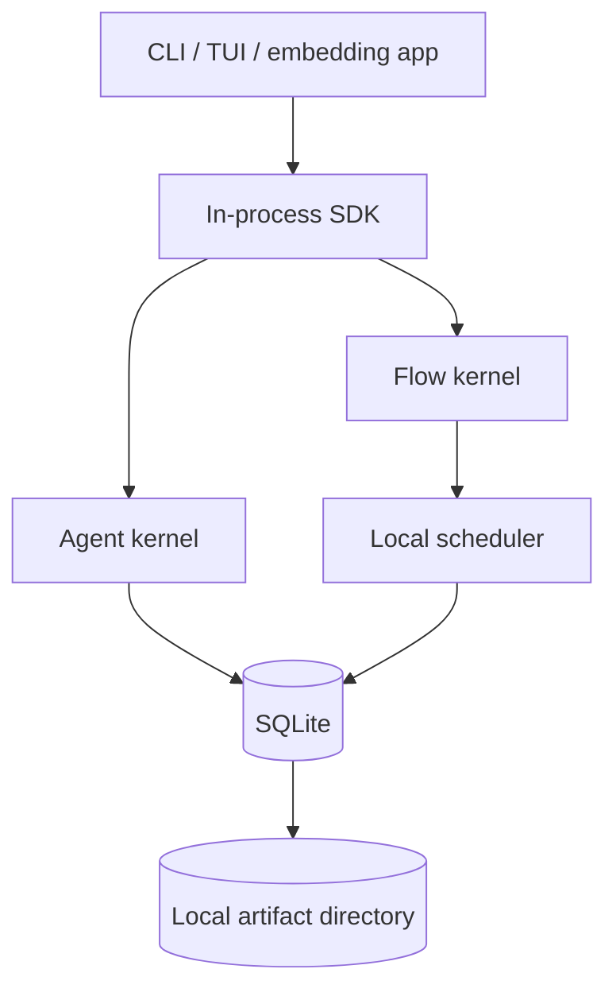

Properties:

- one binary can run Agent and Flow;
- no network control plane required;
- local worker tasks use Tokio;
- SQLite and local artifact directory are default;
- server-grade outbox/inbox semantics are retained even when dispatch is in-process;
- process restart exercises real recovery.

### 32.2 Local daemon profile

```text
ww CLI/TUI -> Unix socket or localhost HTTP/SSE -> ww serve
                                               -> Agent/Flow workers
                                               -> SQLite
```

Properties:

- one owner process for durable state;
- interactive clients can detach/reconnect;
- long-running Flows survive terminal exit;
- local authentication uses OS/user boundary plus optional token;
- daemon upgrades drain or checkpoint work before replacement.

### 32.3 Server profile

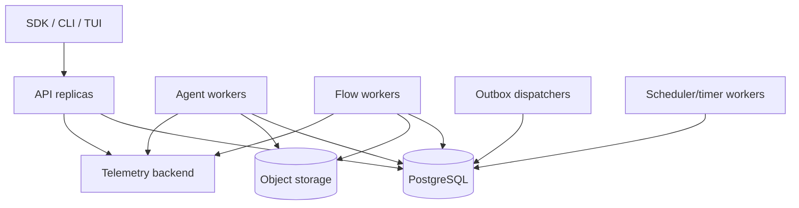

Services can share one binary with role flags initially:

```text
ww serve --roles api,agent-worker,flow-worker,scheduler,dispatcher
```

Split deployables only when scaling or security isolation requires it.

### 32.4 Operational probes

- liveness: event loop/process is responsive;
- readiness: database migrations compatible, store reachable, worker role initialized;
- provider readiness: reported separately, not required for Flow-only operation;
- scheduler lag: oldest ready work age;
- outbox lag: oldest undelivered item age;
- wait age and overdue timers;
- lease-loss and conflict rate;
- audit append latency;
- model/tool/external failure rate;
- storage/artifact capacity.

### 32.5 Upgrade strategy

1. deploy code that can read old and new payload versions;
2. apply backward-compatible schema migration;
3. switch writers to new version;
4. create new checkpoints lazily or through a migration job;
5. remove old readers only after no active execution depends on them.

Running Flow definitions remain pinned. Running Agent configurations remain snapshotted. Deployment never silently upgrades their semantics.

---

## 33. Testing and conformance strategy

### 33.1 Test pyramid

| Layer | Required tests |
| --- | --- |
| Types/reducers | unit, property, serialization compatibility |
| Agent kernel | recorded provider streams, tool ordering, cancellation, budgets |
| Flow interpreter | pure fixture tests for every supported OWS task and transition |
| Store adapters | shared contract suite against SQLite and PostgreSQL |
| External execution | outbox/inbox duplicate, timeout, retry, query, cancellation |
| Policy | effect normalization, deny-by-default, approval digest, sandbox escape |
| API/SDK | idempotency, cursors, reconnect, versioning, auth |
| TUI/CLI | snapshot/event reduction, machine output, terminal fault tolerance |
| End-to-end | process kill/restart across model/tool/Flow wait boundaries |

### 33.2 Agent conformance fixtures

Provider adapters run the same scenarios:

- text-only success;
- one tool call;
- multiple parallel tool calls;
- mixed text and tool calls;
- fragmented JSON arguments;
- tool call truncated by length stop;
- provider error before first delta;
- disconnect after partial output;
- cancellation;
- usage present/absent;
- context overflow and retry after compaction.

The fixture asserts normalized `ModelEvent` and final `ModelResponse`, not vendor payload equality.

### 33.3 Tool conformance fixtures

- schema rejection before policy/effect;
- effect descriptor matches normalized arguments;
- denial and approval paths;
- progress backpressure;
- output truncation and artifact spill;
- sequential and parallel batch ordering;
- process cancellation;
- symlink/path escape prevention;
- replay policy recovery.

### 33.4 OWS conformance

Run:

1. official OWS 1.0.3 schema fixtures;
2. WorkWeave profile positive/negative fixtures;
3. all 12 canonical WorkWeave workflows;
4. task-path resolution and source-map checks;
5. static terminal-path and reachability checks;
6. strict jq expression fixtures;
7. deterministic interpreter snapshots;
8. unsupported-feature fail-closed tests.

The first profile target is exactly the pinned `workweave.ows/0.1.0` subset. Do not advertise general OWS conformance until the official conformance surface proves it.

### 33.5 Determinism tests

For Flow:

```text
same compiled plan
+ same FlowSnapshot bytes
+ same external completed-result set
= identical StepPlan bytes/digest
```

Property tests generate contexts and token lineages. Any clock/ID/random input enters only during apply, not plan.

For Agent recovery:

```text
same checkpoint
+ same ordered Agent records
= identical AgentRecoveryState
```

### 33.6 Fault-injection matrix

Kill the process:

- after Agent run creation;
- after model request commit, before network send;
- during provider stream;
- after response commit, before tool start;
- after unsafe tool start, before result;
- after tool result, before turn commit;
- after Flow plan, before commit;
- after outbox commit, before dispatch;
- after remote accept, before receipt commit;
- after inbox commit/token resume;
- during branch join;
- during cancellation propagation;
- during artifact write/metadata commit.

Each test states expected resumed, retried, failed, or intervention behavior. “It probably continues” is not acceptable.

### 33.7 Storage contract suite

The same tests run against SQLite and PostgreSQL:

- optimistic version conflict;
- lease acquisition/renewal/loss/fencing;
- monotonic per-execution event sequence;
- atomic state+event+outbox;
- inbox dedupe;
- cursor pagination;
- checkpoint parent lineage;
- migration compatibility;
- cancellation/terminal invariants.

### 33.8 Reference parity tests

Pi and LangGraph are not compatibility targets, but selected behavioral tests protect borrowed lessons:

- Pi-style parallel tool completion still yields source-ordered tool-result messages;
- `length`-truncated tool calls never execute;
- terminal listener/stream settlement is deterministic;
- LangGraph-style write-before-checkpoint ordering is preserved;
- interrupts/waits survive restart;
- nested child streams retain scope/parent identity.

---

## 34. Implementation sequence and Goal boundaries

### 34.1 G002 — shared runtime walking skeleton

**Purpose:** prove the common substrate without pretending to implement both engines.

Deliver:

- Rust workspace and dependency rules;
- typed IDs and execution lifecycle;
- SQLite migrations;
- transactionally committed `executions` + `execution_events`;
- cancellation token and durable cancel request;
- artifacts on local filesystem;
- SDK run inspection/event stream;
- `ww run inspect/events` CLI;
- store/reducer property tests.

Exit criteria:

- create, run, cancel, and terminalize a synthetic execution;
- kill/restart and inspect identical state/history;
- no Agent/Flow-specific type leaks into common runtime.

### 34.2 G003 — thin Agent kernel

Deliver:

- provider-neutral message/model/stream types;
- one concrete provider adapter;
- functional model→tool→model loop;
- `fs.read` and one structured deterministic test tool;
- tool schema validation, policy, replay declaration;
- finalized response/tool/turn durability;
- cancellation, deadline, request/tool budgets;
- recorded-stream provider tests;
- `ww agent run` and SDK.

Exit criteria:

- one real or recorded provider completes a tool round trip;
- process restart never replays an unsafe ambiguous tool;
- audit reconstructs request, response, tool, usage, and terminal result;
- no Flow dependency exists.

### 34.3 G004 — deterministic Flow kernel

Deliver:

- immutable OWS definition registry and digest pin;
- official schema + WorkWeave profile validation;
- compiled task-path/source-map cache;
- strict jq adapter;
- `FlowInstance`, `FlowToken`, context, waits;
- pure interpreter and transactional applier;
- `set`, `switch`, `call:function`, `listen`, named transition, and `end`;
- fake external executor and signal API;
- `ww workflow validate/accept` and `ww flow run/inspect/signal`.

Exit criteria:

- same snapshot produces same `StepPlan` digest;
- function call persists wait/outbox before dispatch;
- event wait survives process restart and resumes only on a matching event;
- unsupported OWS features reject with capability codes.

### 34.4 G005 — Flow→Agent integration

Deliver:

- local A2A adapter;
- remote A2A adapter contract stub/recorded test;
- child execution tree;
- outbox/inbox completion delivery;
- parent cancellation propagation;
- Flow result mapping/output/export;
- end-to-end audit tree and TUI/CLI projection.

Exit criteria:

```text
Flow call:a2a
  -> local Agent
      -> model
      -> tool
      -> model terminal result
  -> inbox
  -> exact FlowToken resumes
  -> Flow completes
```

Kill/restart after outbox commit and after Agent completion; the final result applies once.

### 34.5 G006 — full frozen OWS profile

Deliver:

- `for`, `fork`, `call:mcp`, and `run.workflow`;
- deterministic branch merge and iteration ordering;
- nested cancellation and child results;
- all 12 canonical WorkWeave workflows executing against controlled service doubles;
- profile conformance report.

### 34.6 G007 — local product experience

Deliver:

- `ww serve` local daemon;
- reconnectable CLI/TUI;
- Agent transcript and Flow token/branch views;
- approval UI;
- artifacts/diff viewer;
- full run tree and event timeline.

### 34.7 G008 — coordinated deployment

Deliver:

- PostgreSQL adapter contract parity;
- leases/fencing and distributed scheduler;
- API authentication/authorization;
- object artifact store;
- scalable workers and operational dashboards;
- upgrade/recovery runbooks.

### 34.8 Later, evidence-driven work

- additional providers/models;
- richer coding tools and hardened sandboxes;
- public process/WASI extension protocol;
- Python/TypeScript SDKs;
- broader OWS versions/profile evolution;
- remote Agent catalog/routing;
- multi-tenant quotas and billing;
- conversation branching and advanced compaction.

---

## 35. Architecture decision summary

| ID | Decision |
| --- | --- |
| A001 | Build one Rust platform with separate Agent and Flow kernels. |
| A002 | Keep WorkWeave Orchestration above the engine. |
| A003 | Treat Agent as a bounded probabilistic worker. |
| A004 | Treat Flow as a deterministic durable OWS interpreter. |
| A005 | Use OWS as authored definition authority; compiled plans are disposable caches. |
| A006 | Share operational substrate, not a universal state machine. |
| A007 | Start with substrate, then a thin Agent, then Flow, then immediate integration. |
| A008 | Use a functional Agent loop inspired by Pi. |
| A009 | Separate Agent context entries from operational recovery records. |
| A010 | Use a pure Flow planner plus transactional applier. |
| A011 | Adapt LangGraph plan/execute/update and checkpoint ordering, not its graph DSL. |
| A012 | Persist external intent/wait/outbox before dispatch. |
| A013 | Provide at-least-once delivery and exactly-once state application, not exactly-once external effects. |
| A014 | Require replay policy for tools and external executions. |
| A015 | Centralize capability policy and approval. |
| A016 | Keep audit canonical and OTel non-authoritative. |
| A017 | Use SQLite first and PostgreSQL through the same behavioral storage contract later. |
| A018 | Expose Agent and Flow as first-class SDK, CLI, and TUI products. |
| A019 | Use local and remote A2A through the same Flow external-execution seam. |
| A020 | Fail closed on unsupported OWS/provider/tool semantics. |

---

## 36. Risks and required proofs

| Risk | Architectural control | Proof required |
| --- | --- | --- |
| common runtime becomes a generic everything-engine | thin lifecycle contract and dependency rules | crate graph test; no Agent↔Flow core dependency |
| OWS plan becomes second DSL | immutable source authority and cache key | source digest round-trip; plan never accepted as input |
| jq behavior differs from profile | pinned adapter and fixture suite | canonical workflow expression conformance |
| provider differences leak into Agent | normalized capability/event protocol | cross-provider conformance fixtures |
| unsafe tool repeats after crash | started record + replay policy | kill test produces intervention, not replay |
| external call executes twice | idempotency/outbox/query/inbox | duplicate dispatch/result fault tests |
| branch context merge is nondeterministic | disjoint-write proof or explicit merge | property test independent of completion order |
| cancellation loses child work | durable tree and cancel outbox | kill/restart cancellation test |
| audit and state disagree | same transaction and invariant checks | consistency audit command |
| event stream loses correctness | committed cursor separated from transient deltas | reconnect test |
| SQLite design blocks server evolution | storage contract and version/fence columns | shared SQLite/Postgres contract suite |
| raw prompts leak secrets | structured redaction and capture policy | security fixtures and retention tests |
| TUI drives hidden mutations | SDK-only control path | architecture/dependency test |
| implementation grows Pi/LangGraph breadth too early | bounded Goal exit criteria | no unsupported provider/plugin/general graph scope in early Goals |

### 36.1 Stop conditions

Pause feature expansion and revise architecture when any of these occurs:

- Flow requires importing Agent internals to invoke a local Agent;
- Agent requires Flow state to execute a run;
- a crash test cannot determine whether an unsafe effect ran;
- a running Flow can observe changed workflow source without migration;
- current state can mutate without an audit event in the same transaction;
- the same OWS snapshot produces different `StepPlan` results;
- a compiled plan starts acquiring authored authority;
- UI/SDK transport choices force engine state semantics;
- the first integrated walking skeleton requires a distributed platform to work.

---

## 37. Implementation review checklist

Before accepting a major change, answer:

### Boundary

- Which kernel or shared component owns it?
- Does it introduce Agent↔Flow core coupling?
- Does it leak Orchestration semantics downward?
- Is a standard contract already adequate?

### Durability

- What is committed before the effect?
- What is committed after the effect?
- What happens at every crash point?
- Is replay safe, idempotent, or prohibited?

### Determinism

- Is the code in Flow planning pure?
- Are clock, IDs, and completed external results explicit inputs?
- Is merge order defined independently of completion order?

### Audit

- Can an operator explain what happened from durable records?
- Are state and event written atomically?
- Are sensitive values redacted before persistence?
- Is the event type/version stable?

### Policy

- Is the effect descriptor complete?
- Does centralized policy decide?
- Are constraints enforced by the executor?
- Does argument change invalidate approval?

### Interfaces

- Is the API idempotent?
- Are errors typed and retryability explicit?
- Can embedded and remote SDKs implement the same contract?
- Does a client timeout avoid pretending to cancel server work?

### Operations

- Can work be cancelled and recovered?
- Are leases fenced?
- Can a slow stream consumer block execution?
- Are readiness and lag observable?

---

## 38. Final target architecture

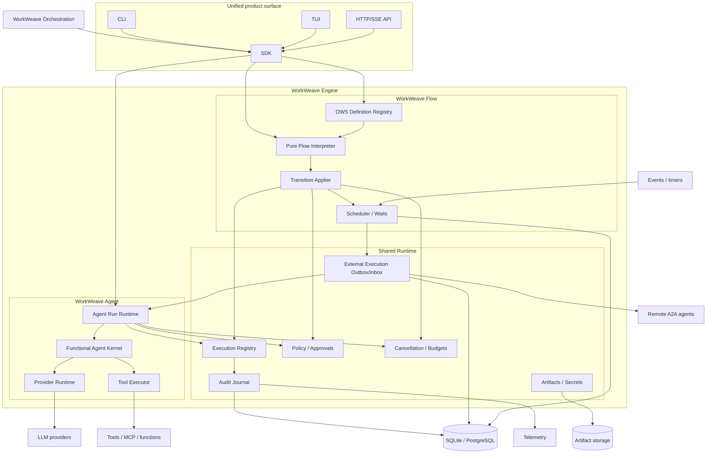

The system succeeds when these statements are simultaneously true:

- an Agent remains recognizably a small, modular LLM/tool loop;
- a Flow remains recognizably a deterministic durable OWS runtime;
- both are independently usable through SDK, CLI, and TUI;
- Flow can invoke Agent locally or remotely without semantic coupling;
- shared runtime provides operational consistency and audit without becoming a third universal execution language;
- process death, retries, cancellation, and external duplication have explicit outcomes rather than optimistic assumptions.

---

## 39. Source map

### WorkWeave and OWS

- [WorkWeave Orchestration design dossier](https://github.com/misawsneto/ww-orchestration/blob/21aac374d28e6ad39944214866780a74b39f8e24/docs/orchestration/WORKWEAVE-ORCHESTRATION-DOSSIER.md)
- [WorkWeave Flow canonical model](https://github.com/misawsneto/ww-orchestration/blob/21aac374d28e6ad39944214866780a74b39f8e24/docs/orchestration/flow/model.yaml)
- [WorkWeave Flow generated model reference](https://github.com/misawsneto/ww-orchestration/blob/21aac374d28e6ad39944214866780a74b39f8e24/docs/orchestration/flow/MODEL.md)
- [WorkWeave OWS profile](https://github.com/misawsneto/ww-orchestration/blob/21aac374d28e6ad39944214866780a74b39f8e24/docs/orchestration/ows/profile.yaml)
- [Canonical task-cycle OWS workflow](https://github.com/misawsneto/ww-orchestration/blob/21aac374d28e6ad39944214866780a74b39f8e24/docs/orchestration/workflows/task-cycle.yaml)
- [OWS 1.0.3 schema](https://github.com/open-workflow-specification/specification/blob/2dd2c84170d5f3e05d58e913e9ca298dcf8d543a/schema/workflow.yaml)

### Pi Agent

- [functional Agent loop](https://github.com/earendil-works/pi/blob/6c87d9a026677b601e8278030dcf1ad97fe0bd86/packages/agent/src/agent-loop.ts)
- [Agent and loop contracts](https://github.com/earendil-works/pi/blob/6c87d9a026677b601e8278030dcf1ad97fe0bd86/packages/agent/src/types.ts)
- [stateful Agent façade](https://github.com/earendil-works/pi/blob/6c87d9a026677b601e8278030dcf1ad97fe0bd86/packages/agent/src/agent.ts)
- [coding-agent session manager](https://github.com/earendil-works/pi/blob/6c87d9a026677b601e8278030dcf1ad97fe0bd86/packages/coding-agent/src/core/session-manager.ts)
- [provider/model runtime](https://github.com/earendil-works/pi/blob/6c87d9a026677b601e8278030dcf1ad97fe0bd86/packages/coding-agent/src/core/model-runtime.ts)
- [server session contracts](https://github.com/earendil-works/pi/blob/6c87d9a026677b601e8278030dcf1ad97fe0bd86/packages/server/src/types.ts)

### Pi future Harness

- [durable entry/record/storage types](https://github.com/earendil-works/pi/blob/6c87d9a026677b601e8278030dcf1ad97fe0bd86/packages/agent/src/harness/session/types.ts)
- [pure recovery reducer](https://github.com/earendil-works/pi/blob/6c87d9a026677b601e8278030dcf1ad97fe0bd86/packages/agent/src/harness/reducer.ts)
- [incomplete Harness façade](https://github.com/earendil-works/pi/blob/6c87d9a026677b601e8278030dcf1ad97fe0bd86/packages/agent/src/harness/agent-harness.ts)

### LangGraph

- [StateGraph construction API](https://github.com/langchain-ai/langgraph/blob/11ee185999b86bfea2d8c0e69cef9a5e37acf686/libs/langgraph/langgraph/graph/state.py)
- [Pregel runtime](https://github.com/langchain-ai/langgraph/blob/11ee185999b86bfea2d8c0e69cef9a5e37acf686/libs/langgraph/langgraph/pregel/main.py)
- [Pregel loop/checkpoint state](https://github.com/langchain-ai/langgraph/blob/11ee185999b86bfea2d8c0e69cef9a5e37acf686/libs/langgraph/langgraph/pregel/_loop.py)
- [concurrent runner and commit behavior](https://github.com/langchain-ai/langgraph/blob/11ee185999b86bfea2d8c0e69cef9a5e37acf686/libs/langgraph/langgraph/pregel/_runner.py)
- [task planning and write application](https://github.com/langchain-ai/langgraph/blob/11ee185999b86bfea2d8c0e69cef9a5e37acf686/libs/langgraph/langgraph/pregel/_algo.py)
- [checkpoint contracts](https://github.com/langchain-ai/langgraph/blob/11ee185999b86bfea2d8c0e69cef9a5e37acf686/libs/checkpoint/langgraph/checkpoint/base/__init__.py)
- [interrupt, durability, task, snapshot, and stream types](https://github.com/langchain-ai/langgraph/blob/11ee185999b86bfea2d8c0e69cef9a5e37acf686/libs/langgraph/langgraph/types.py)

---

## 40. Immediate next action

Create **G002 — Shared Runtime Walking Skeleton** from section 34.1. Do not implement a full Agent or Flow in G002. The purpose is to make execution identity, durable events, cancellation, SQLite transactions, artifacts, and inspection real so both kernels start on a tested substrate.

After G002, implement the thin Agent kernel and then the Flow kernel. The first architecture acceptance milestone remains the restart-safe integrated `Flow → Agent → Tool → Flow` path.
